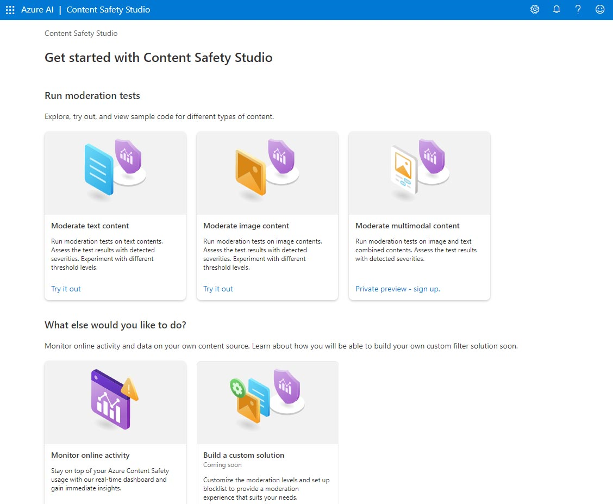

---
lab:
  title: استكشاف خدمات Azure AI
---

# استكشاف خدمات Azure AI

تساعد خدمات الذكاء الاصطناعي في Azure المستخدمين على إنشاء تطبيقات الذكاء الاصطناعي باستخدام واجهات برمجة التطبيقات المبتكرة والنماذج الجاهزة والمبنية مسبقًا والقابلة للتخصيص. في هذا التمرين، ستلقي نظرة على إحدى الخدمات، سلامة المحتوى بالذكاء الاصطناعي في Azure وكذلك استوديو سلامة المحتوى.

يمكنك استوديو سلامة المحتوى من استكشاف كيفية إدارة محتوى النص والصورة. يمكنك تشغيل اختبارات على نموذج النص أو الصور والحصول على درجة خطورة تتراوح من آمنة إلى عالية الخطورة لكل فئة. في هذا التمرين المعملي، ستقوم بإنشاء مورد خدمة واحدة في استوديو سلامة المحتوى واختبار وظائفه. 

> **ملاحظه** الهدف من هذا التمرين هو تكوين فكرة عامة عن كيفية توفير خدمات Azure للذكاء الاصطناعي واستخدامها. يتم استخدام المحتوى السلامة كمثال، ولكن لا يتوقع منك اكتساب معرفة شاملة بسلامة المحتوى في هذا التمرين!

## التنقل في استوديو سلامة المحتوى 

1. افتح [استوديو سلامة المحتوى](https://contentsafety.cognitive.azure.com?azure-portal=true). إذا لم تقم بتسجيل الدخول، فستحتاج إلى تسجيل الدخول. حدد **تسجيل الدخول** في الركن الأيمن العلوي من الشاشة. استخدم البريد الإلكتروني وكلمة المرور المرتبطين باشتراك Azure لتسجيل الدخول. 

2. تم إعداد استوديو سلامة المحتوى مثل العديد من الاستوديوهات الأخرى لخدمات الذكاء الاصطناعي في Azure. في القائمة في أعلى الشاشة، انقر فوق الأيقونة الموجودة على يسار *الذكاء الاصطناعي في Azure*. سترى قائمة منسدلة من الاستوديوهات الأخرى المصممة للتطوير باستخدام خدمات الذكاء الاصطناعي في Azure. يمكنك النقر فوق الأيقونة مرة أخرى لإخفاء القائمة.

  

## ربط مورد بالاستوديو 

قبل استخدام الاستوديو، تحتاج إلى ربط مورد خدمات الذكاء الاصطناعي في Azure بالاستوديو. اعتمادًا على الاستوديو، قد تجد أنك بحاجة إلى مورد خدمة واحدة محدد، أو يمكنك استخدام مورد عام متعدد الخدمات. في حالة استوديو سلامة المحتوى، يمكنك استخدام الخدمة عن طريق إنشاء مورد *سلامة محتوى* لخدمة واحدة أو مورد خدمات *الذكاء الاصطناعي في Azure* عام متعدد الخدمات. في الخطوات أدناه، سنقوم بإنشاء مورد سلامة محتوى لخدمة واحدة. 

1. انقر على أيقونة **الإعدادات** أعلى يمين الشاشة. 

2. في صفحة **لإعدادات**، سترى علامة تبويب *الدليل* وعلامة تبويب *المورد*. في علامة التبويب *المورد*، حدد **إنشاء مورد جديد**. ينقلك هذا إلى صفحة لإنشاء مورد في مدخل Microsoft Azure.

> **ملاحظة** تسمح علامة التبويب *الدليل* للمستخدمين بتحديد دلائل مختلفة لإنشاء الموارد منها. لا تحتاج إلى تغيير إعداداته إلا إذا كنت ترغب في استخدام دليل مختلف. 

3. في صفحة إنشاء *استوديو سلامة المحتوى* في [مدخل Microsoft Azure](https://portal.azure.com?azure-portal=true)، تحتاج إلى تكوين العديد من التفاصيل لإنشاء موردك. قم بتكوينه بالإعدادات التالية:
    - **الاشتراك**: *اشتراك Azure الخاص بك*.
    - **مجموعة الموارد**: *أنشئ مجموعة موارد جديدة ذات اسم فريد*.
    - **المنطقة**: *اختر أي منطقة متوفِّرة إذا كنت في شرق الولايات المتحدة، فاستخدم "شرق الولايات المتحدة 2"*.
    - **الاسم**: *أدخل اسمًا مميزًا*.
    - **مستوى التسعير**: مجاني (F0)

4. حدد **مراجعة + إنشاء** وراجع التكوين. وبعد ذلك، حدد **إنشاء**. ستشير الشاشة إلى وقت اكتمال النشر. 

*تهانينا! لقد قمت للتو بإنشاء مورد خدمات الذكاء الاصطناعي في Azure أو توفيره. المورد الذي قمت بتوفيره على وجه الخصوص هو مورد خدمة سلامة محتوى ذو خدمة واحدة.*

5. عند اكتمال النشر، افتح علامة تبويب جديدة وارجع إلى [استوديو سلامة المحتوى](https://contentsafety.cognitive.azure.com?azure-portal=true). 

6. حدد أيقونة **الإعدادات** في الجزء العلوي الأيمن من الشاشة مرة أخرى. هذه المرة يجب أن ترى أنه تمت إضافة المورد الذي تم إنشاؤه حديثًا إلى القائمة.  

  
    
<b>استكشاف الأخطاء وإصلاحها</b>: الأذونات للمتعلمين ذاتيي الوتيرة

    
<b>إذا كنت تستخدم بيئة نشاط عملي يوفرها أحد المدربين، فيمكنك تخطي هذه الخطوات.</b> وإلا، فتابع الخطوات التالية:

    <ul>
        <li>حدد <b>عرض كل الخصائص في مدخل Azure</b> أسفل شاشة *الإعدادات*.</li>
        <li>في مدخل Azure، حدد مورد <em>أمان المحتوي</em> الذي قمت بإنشائه للتو. بعد ذلك، حدد على الجزء الأيمن <b>التحكم بالوصول (IAM)</b> بعد ذلك، في الجزء المفتوح، حدد <b>إضافة</b> بجانب علامة الإضافة + وحدد <b>إضافة تعيين دور</b>.</li>
        <li>ابحث عن <b>مستخدم الخدمات المعرفية</b> في قائمة الأدوار، وحدده. بعد ذلك حدد <b>التالي</b>. </li>
        <li>ضمن <b>تعيين الوصول إلى</b>، اختر <b>المستخدم أو المجموعة أو المسؤول الرئيسي للخدمة</b>، <b>+ تحديد الأعضاء</b>، حدد اسمك. اترك الوصف فارغًا.</li>
        <li>حدد <b>التالي</b>. في صفحة <b>نوع التعيين</b>، حدد <b>نوع التعيين: نشط</b>. حدد <b>مدة الواجب: دائم</b>. حدد <b>التالي</b>.</li>
        <li>حدد <b>مراجعة وتعيين</b>، ثم <b>مراجعة وتعيين</b> لإضافة تعيين الدور.</li>
        <li>ارجع إلى Content Safety Studio على https://contentsafety.cognitive.azure.com. بعد ذلك، حدد أيقونة <b>الإعدادات</b> أعلى الجانب الأيسر من الشاشة. حدد مورد أمان المحتوى الذي أنشأته. تأكد من أن <em>تعيينات الأدوار الحالية</em> تتضمن <b>مستخدم الخدمات المعرفية</b>. قد تحتاج إلى الانتظار لبعض الوقت وتحديث الصفحة لرؤية تعيين الدور.</li>
    </ul>

7. إذا لم تقم بذلك بالفعل، فحدد مورد أمان المحتوى الذي أنشأته. 

8. انقر فوق **استخدام المورد** أسفل الشاشة. سيتم نقلك مرة أخرى إلى الصفحة الرئيسية للاستوديو. الآن يمكنك البدء في استخدام الاستوديو مع المورد الذي تم إنشاؤه حديثًا.

## جرب الإشراف على النص في استوديو سلامة المحتوى

1. في الصفحة الرئيسية لاستوديو سلامة المحتوى، ضمن *تشغيل اختبارات الإشراف*، انتقل إلى **مربع الإشراف على المحتوى** وانقر على **جربه الآن**.
2. ضمن تشغيل اختبار بسيط، انقر فوق **سلامة المحتوى**. لاحظ أنه يتم عرض النص في المربع أدناه. 
3. انقر فوق **تشغيل الاختبار**. يؤدي تشغيل اختبار إلى استدعاء نموذج التعلم العميق لاستوديو سلامة المحتوى. تم بالفعل تدريب نموذج التعلم العميق على التعرف على المحتوى غير الآمن.
4. في لوحة *النتائج*، افحص النتائج. هناك أربعة مستويات خطورة من آمنة إلى عالية، وأربعة أنواع من المحتوى الضار. هل تعتبر خدمة سلامة المحتوى بالذكاء الاصطناعي أن هذه العينة مقبولة أم لا؟ ما يجب ملاحظته هو أن النتائج تقع ضمن نطاق الثقة. يمكن للنموذج المُدرب جيدًا، مثل أحد نماذج الذكاء الاصطناعي الجاهزة في Azure، إرجاع النتائج التي لديها احتمال كبير لمطابقة ما قد يصنفه الإنسان على النتيجة. في كل مرة تقوم فيها بتشغيل اختبار، يمكنك استدعاء النموذج مرة أخرى. 
5. الآن جرّب عينة أخرى. حدد النص ضمن المحتوى العنيف الذي به خطأ إملائي. تحقق من عرض المحتوى في المربع أدناه.
6. انقر فوق **تشغيل الاختبار** وافحص النتائج في لوحة النتائج مرة أخرى. 

يمكنك تشغيل الاختبارات على جميع العينات المقدمة، ثم فحص النتائج.

## تحقق من المفاتيح ونقطة النهاية

يمكن برمجة هذه القدرات التي اختبرتها في جميع أنواع التطبيقات. يمكن العثور على المفاتيح ونقطة النهاية المستخدمة لتطوير التطبيق في كل من استوديو سلامة المحتوى ومدخل Microsoft Azure. 

1. في استوديو سلامة المحتوى، انتقل مرة أخرى إلى صفحة **الإعدادات**، مع تحديد علامة التبويب *المواراد*. البحث عن المورد الذي استخدمته. مرر حتى ترى نقطة النهاية والمفتاح لموردك. 
2. في مدخل Microsoft Azure، سترى أن هذه هي *نفس* نقطة النهاية والمفاتيح *المختلفة* لموردك. للتحقق من ذلك، انتقل إلى [مدخل Microsoft Azure](https://portal.azure.com?auzre-portal=true). ابحث عن *سلامة المحتوى* في شريط البحث العلوي. ابحث عن موردك وانقر فوقه. في القائمة اليسرى، ابحث ضمن *إدارة الموارد* للـ *مفاتيح ونقاط النهاية*. حدد **المفتيح ونقطة النهاية** لعرض نقطة النهاية والمفاتيح لموردك. 

بعد الانتهاء، يمكنك حذف مورد سلامة المحتوى من مدخل Microsoft Azure. حذف المورد هو طريقة لتقليل التكاليف التي تتراكم عند وجود المورد في الاشتراك. للقيام بذلك، انتقل إلى صفحة **نظرة عامة** لموردك لسلامة المحتوى. حدد **حذف** في الجزء العلوي من الشاشة.

