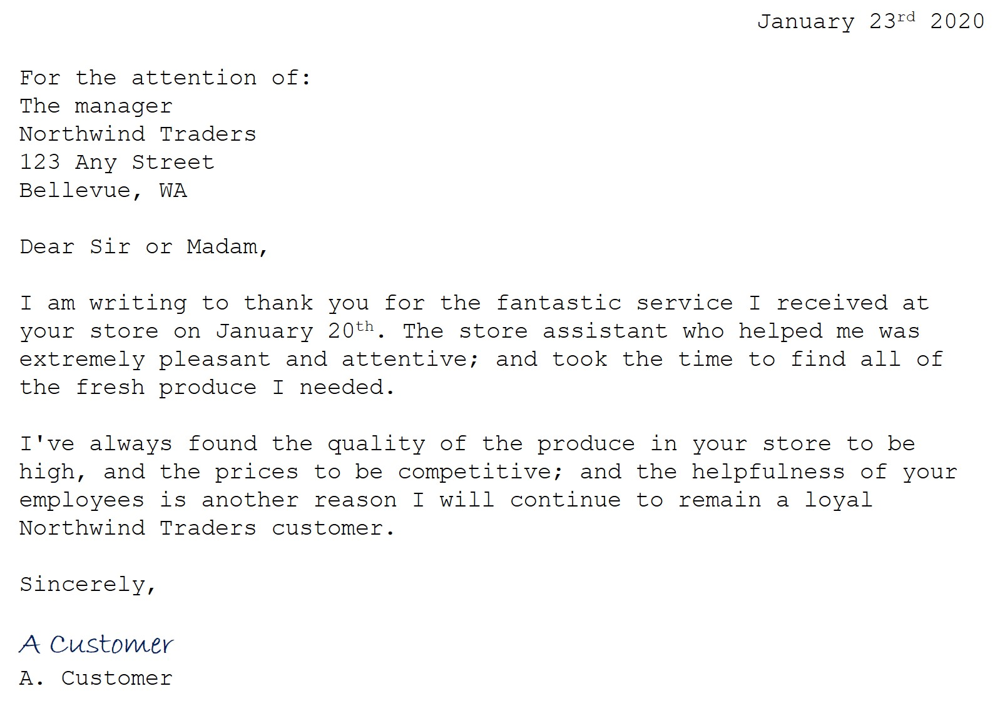

---
lab:
  title: قراءة النص في Vision Studio
---

# قراءة النص في Vision Studio

في هذا التمرين، ستستخدم خدمة Azure الذكاء الاصطناعي لاستكشاف قدرات التعرف البصري على الأحرف في Azure الذكاء الاصطناعي Vision. ستستخدم Vision Studio لتجربة استخراج النص من الصور، دون الحاجة إلى كتابة أي تعليمة برمجية.

يتمثل التحدي الشائع لرؤية الكمبيوتر في اكتشاف النص المضمن داخل الصورة وتفسيره. يعرف هذا باسم التعرف البصري على الحروف (OCR). في هذا التمرين، ستستخدم مورد خدمات Azure الذكاء الاصطناعي، والذي يتضمن خدمات Azure الذكاء الاصطناعي Vision. ثم ستستخدم Vision Studio لتجربة التعرف البصري على الحروف مع أنواع مختلفة من الصور.

## إنشاء مورد *خدمات ذكاء اصطناعي في Azure*

يمكنك استخدام قدرات التعرف البصري على الحروف في Azure الذكاء الاصطناعي Vision مع **مورد خدمات** Azure الذكاء الاصطناعي متعدد الخدمات. إذا لم تكن قد قمت بذلك بالفعل، فأنشئ مورد **خدمات ذكاء اصطناعي في Azure** في اشتراكك في Azure.

1. في علامة تبويب مستعرض أخرى، افتح **مدخل** Microsoft Azure في [https://portal.azure.com](https://portal.azure.com?azure-portal=true)، وقم بتسجيل الدخول باستخدام حساب Microsoft المقترن باشتراك Azure الخاص بك.

1. انقر فوق زر **＋أنشئ مورد** وابحث عن *خدمات ذكاء اصطناعي في Azure*. حدد **إنشاء** **خطة خدمات الذكاء الاصطناعي في Azure**. سيتم نقلك إلى صفحة لإنشاء مورد خدمات ذكاء اصطناعي في Azure. قم بتكوينه بالإعدادات التالية:
    - **الاشتراك**: *اشتراك Azure الخاص بك*.
    - **مجموعة الموارد**: *أنشئ مجموعة موارد جديدة ذات اسم فريد*.
    - **المنطقة**: شرق الولايات المتحدة.
    - **الاسم**: *أدخل اسمًا مميزًا*.
    - **مستوى** التسعير: *S0 قياسي.*
    - **من خلال تحديد هذا المربع، أقر بأنني قرأت وفهمت جميع المصطلحات أدناه**: *محددة*.

1. حدد **Review + create** ثم **Create** وانتظر حتى يكتمل النشر.

## الاتصال مورد خدمة Azure الذكاء الاصطناعي إلى Vision Studio

بعد ذلك، قم بتوصيل مورد خدمات Azure الذكاء الاصطناعي الذي قمت بتوفيره أعلاه ب Vision Studio.

1. في علامة تبويب متصفح أخرى، انتقل إلى **Vision Studio** فيhttps://portal.vision.cognitive.azure.com .

1. سجل الدخول باستخدام حسابك وتأكد من أنك تستخدم نفس الدليل الذي أنشأت فيه مورد خدمات Azure الذكاء الاصطناعي.

1. في الصفحة الرئيسية ل Vision Studio، حدد **View all resources** ضمن **عنوان Getting started with Vision** .

    

1. في **الصفحة تحديد مورد للعمل معه** ، مرر مؤشر الماوس فوق المورد الذي أنشأته أعلاه في القائمة ثم حدد المربع إلى يسار اسم المورد، ثم حدد **تحديد كمورد** افتراضي.

    > **ملاحظة** : إذا لم يكن المورد مدرجا، فقد تحتاج إلى **تحديث** الصفحة.

    

1. أغلق صفحة الإعدادات عن طريق تحديد "x" في الجزء العلوي الأيسر من الشاشة.

## استخراج النص من الصور في Vision Studio
    
1. في مستعرض ويب، انتقل إلى **Vision Studio** في [https://portal.vision.cognitive.azure.com](https://portal.vision.cognitive.azure.com?azure-portal=true).

1. في الصفحة المقصودة **بدء استخدام Vision** ، حدد **التعرف** البصري على الأحرف، ثم **تجانب استخراج النص من الصور** .

1. **ضمن العنوان الفرعي Try It Out**، أقر بنهج استخدام الموارد عن طريق قراءة المربع وتحديده.  

1. حدد [**https://aka.ms/mslearn-ocr-images](https://aka.ms/mslearn-ocr-images)** لتنزيل **ocr-images.zip.** ثم افتح المجلد.

1. في المدخل، حدد **استعراض بحثا عن ملف** وانتقل إلى المجلد على الكمبيوتر حيث قمت بتنزيل **ocr-images.zip**. حدد **advert.jpg** وحدد **فتح**.

1. الآن راجع ما تم إرجاعه:
    - في **السمات المكتشفة**، يتم تنظيم أي نص موجود في الصورة في بنية هرمية للمناطق والخطوط والكلمات.
    - في الصورة، تتم الإشارة إلى موقع النص بواسطة مربع إحاطة، كما هو موضح هنا:

    

1. يمكنك الآن تجربة صورة أخرى. حدد **استعراض بحثا عن ملف** وانتقل إلى المجلد حيث حفظت الملفات من GitHub. حدد **letter.jpg**.

    

1. راجع نتائج الصورة الثانية. يجب أن ترجع النص ومربعات الإحاطة للنص. إذا كان لديك الوقت، فجرب **note.jpg** receipt.jpg****.

## تنظيف

إذا كنت لا تنوي إجراء المزيد من التدريبات، فاحذف أي موارد لم تعد بحاجة إليها. وهذا يتجنب تراكم أي تكاليف غير ضرورية.

1. افتح مدخل **** Microsoft Azure فيhttps://portal.azure.comوحدد مجموعة الموارد التي تحتوي على المورد الذي أنشأته.
1. حدد المورد وحدد **حذف** ثم **نعم** للتأكيد. ثم يتم حذف المورد.

## معرفة المزيد

لمعرفة المزيد حول ما يمكنك القيام به مع هذه الخدمة، راجع وثائق Azure الذكاء الاصطناعي Vision حول التعرف[ البصري على ](https://learn.microsoft.com/azure/ai-services/computer-vision/overview-ocr)الأحرف.
