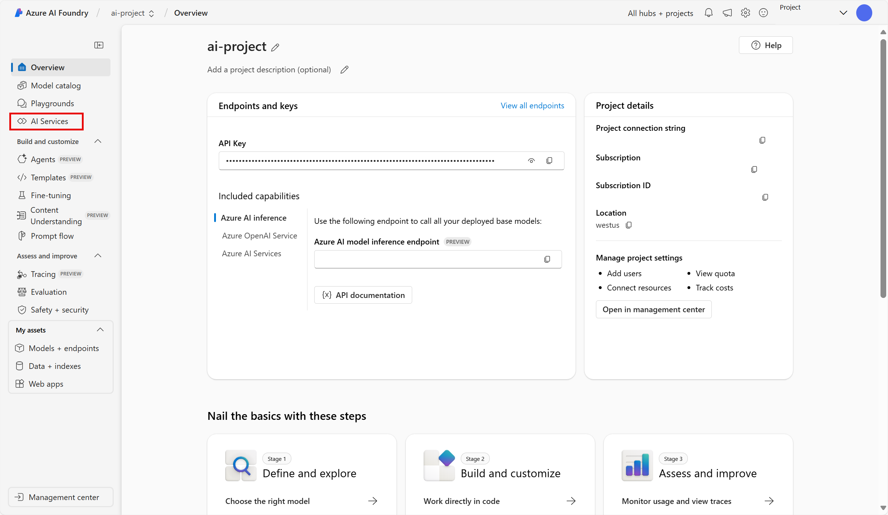
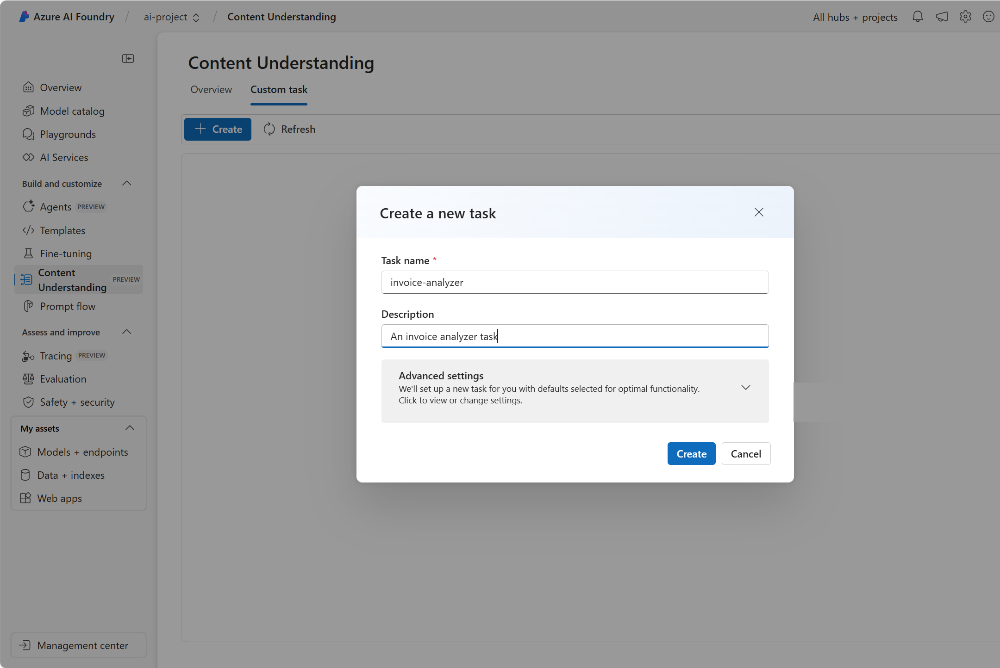
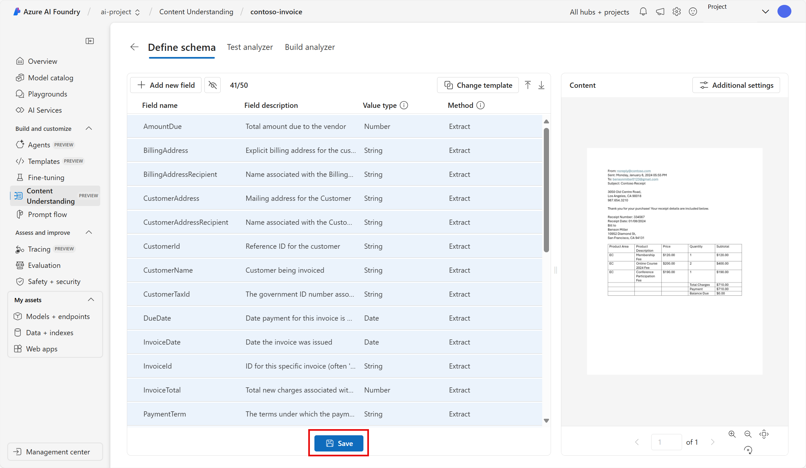

---
lab:
  title: استخراج البيانات باستخدام "فهم المحتوى" في مدخل Azure AI Foundry
---

# استخراج البيانات باستخدام "فهم المحتوى" في مدخل Azure AI Foundry

يستخدم **فهم المحتوى باستخدام الذكاء الاصطناعي في Azure (معاينة)** الذكاء الاصطناعي التوليدي لمعالجة محتوى من العديد من الأنواع (المستندات والصور ومقاطع الفيديو والصوت) إلى تنسيق إخراج محدد من قبل المُستخدم.

في هذا التمرين، ستستخدم "فهم المحتوى" باستخدام الذكاء الاصطناعي في Azure في مدخل Azure AI Foundry، وهي منصة Microsoft لإنشاء التطبيقات الذكية، للتعرف على البيانات من الفواتير. 

يستغرق هذا التمرين حوالي **25** دقيقة.

## إنشاء مشروع في مصنع الذكاء الاصطناعي في Azure

دعنا نبدأ بإنشاء مشروع في مصنع الذكاء الاصطناعي في Azure.

1. في متصفح الويب، افتح [مدخل Azure AI Foundry](https://ai.azure.com) على `https://ai.azure.com` وسجّل الدخول باستخدام بيانات اعتماد Azure الخاصة بك. أغلق أي تلميحات أو أجزاء التشغيل السريع يتم فتحه عندما تقوم بتسجيل الدخول لأول مرة، وإذا لزم الأمر،استخدم شعار **Azure AI Foundry** في أعلى اليسار للانتقال إلى الصفحة الرئيسية، والتي تبدو مشابهة للصورة التالية (أغلق جزء **المساعدة** إذا كان مفتوحًا):

    

1. في الصفحة الرئيسية، حدد **+ إنشاء مشروع**.

1. في معالج** إنشاء مشروع**، أدخل اسمًا مناسبًا لمشروعك وإذا تم اقتراح مركز موجود، فحدد خيار إنشاء مركز جديد. ثم راجع موارد Azure التي سيتم إنشاؤها تلقائيًا لدعم مركزك ومشروعك.

1. حدد **تخصيص** وحدد الإعدادات التالية لمركزك:
    - **اسم المركز**: *اسم صالح لمركزك*
    - **Subscription**: *اشتراكك في Azure*
    - **Resource group**: *إنشاء مجموعة موارد أو تحديدها*
    - **Location:** West US 
    - **الاتصال بخدمات Azure AI أو Azure OpenAI**: *إنشاء مزود جديد لخدمات الذكاء الاصطناعي*
    - **الاتصال بـ Azure AI Search**: تخطي الاتصال

1. حدد **التالي** لمراجعة التكوين الخاص بك. ثم حدد **إنشاء** وانتظر حتى تكتمل العملية.

1. عند إنشاء مشروعك، أغلق أي تلميحات يتم عرضها وراجع صفحة المشروع في مدخل مصنع الذكاء الاصطناعي في Azure، والذي يجب أن يبدو مشابهة للصورة التالية:

    
 
1. انتقل إلى القائمة الموجودة على الجانب الأيسر من الشاشة. ثم حدد **خدمات الذكاء الاصطناعي**.

1. في صفحة *خدمات الذكاء الاصطناعي*، حدد لوحة *فهم المحتوى* لتجربة إمكانات فهم المحتوى باستخدام الذكاء الاصطناعي في Azure.

## تحليل فاتورة باستخدام فهم المحتوى باستخدام الذكاء الاصطناعي في Azure في Azure AI Foundry 

افترض أنك تريد استخراج البيانات من العديد من الفواتير ووضع البيانات في قاعدة بيانات. يمكنك استعمال فهم المحتوى باستخدام الذكاء الاصطناعي في Azure لتحليل فاتورة واحدة وإنشاء مُحلل خاص بك يمكنه تحليل فواتير أخرى مماثلة. لنبدأ بإنشاء مهمة فهم المحتوى.

1. حدد **المحلل المخصص**. 

1. حدد **+ إنشاء** واستخدم الإعدادات التالية لإنشاء مهمة فهم المحتوى:
    - **اسم المهمة**: contoso-invoice
    - **الوصف**: مهمة تحليل الفاتورة
    - **اتصال خدمات الذكاء الاصطناعي في Azure**: *استخدم الإعداد الافتراضي*
    - **حساب تخزين Azure Blob**: *استخدم الإعداد الافتراضي*

1. حدد **إنشاء**، ثم انتظر حتى يتم إنشاء مهمتك. 
1. حدد مهمة **contoso-invoice** الخاصة بك. 

#### حدد مخططك 

1. في صفحة *تحديد المخطط*، يمكنك إضافة ملفات اختبار. نزّل [contoso-invoice-1.pdf](https://raw.githubusercontent.com/MicrosoftLearning/mslearn-ai-fundamentals/refs/heads/main/contoso-invoice-1.pdf) من `https://raw.githubusercontent.com/MicrosoftLearning/mslearn-ai-fundamentals/refs/heads/main/data/contoso-invoice-1.pdf`. 

1. حمّل الملف إلى صفحة *تحديد المخطط*. حدد قالب *تحليل الفاتورة*. يحتوي قالب الفاتورة على حقول بيانات محددة مسبقًا والتي سيحاول المُحلل اكتشافها. 

    

1. حدد **إنشاء**. الآن لديك القدرة على تعديل المخطط عن طريق إضافة أو حذف الحقول. عند الانتهاء من مراجعة الحقول، حدد **حفظ**.

    

1. انتظر حتى يتم إجراء التحليل. قد يستغرق هذا بعض الوقت.

#### اختبار المحلل 

1. عندما ينتهي التحليل، ستتمكن من رؤية أداء المحلل في صفحة *مُحلل الاختبار*. راجع علامة التبويب *الحقول*. هل تتوافق هذه البيانات مع ما تراه في الفاتورة؟ 
    

1. لاحظ *درجة الثقة* بجوار كل حقل. تمثل درجة الثقة مدى ثقة النموذج في دقة نتيجته. تشير النتائج بدرجات ثقة أقرب إلى 100٪ إلى ثقة أكبر في التنبؤ.
1. راجع علامة التبويب *النتائج*. المعلومات نفسها التي تراها في علامة تبويب الحقول موجودة في علامة تبويب النتائج بتنسيق JSON. يُظهر JSON شكل المعلومات عند إرسالها من وإلى تطبيق العميل. 

    

1. يجب أن تكون خدمة "فهم المحتوى" قد حددت بشكل صحيح النص الذي يتوافق مع الحقول الموجودة في المخطط. إذا لم يتم ذلك، فيمكنك استخدام صفحة *بيانات الوصف* لتحميل نموذج عينة آخر وتحديد النص الصحيح لكل حقل بشكل صريح. عندما تكون راضيًا عن مدى قدرة المحلل على اكتشاف البيانات الموجودة في الفاتورة، حدد علامة التبويب **إنشاء المُحلل**. 

#### إنشاء المُحلل الخاص بك 

الآن بعد أن درّبت نموذج لاستخراج الحقول من فاتورتك النموذجية، يمكنك إنشاء مُحلل لاستخدامه مع نماذج مماثلة. من خلال إنشاء محلل، يمكنك توزيع النموذج واستخدامه لأتمتة مهام الفواتير الأخرى.

1. في علامة التبويب *إنشاء مُحلل*، حدد **+ إنشاء مُحلل**. إدخل التالي: 
    - **الاسم**: مُحلل-الفاتورة
    - **الوصف**: محلل فاتورة

    

1. حدد **إنشاء**. انتظر حتى يصبح المحلل الجديد جاهزًا (استخدم زر تحديث للتحقق). يستخدم المُحلل الخاص بك نموذجًا تنبؤيًا يعتمد على المخطط الذي حددته واختبرته في الخطوات السابقة. 
1. الآن دعنا نحاول اختبار المُحلل الذي قمت ببنائه. نزّل فاتورة مختلفة من Contoso [contoso-invoice-2.pdf](https://raw.githubusercontent.com/MicrosoftLearning/mslearn-ai-fundamentals/refs/heads/main/data/contoso-invoice-2.pdf) من `https://raw.githubusercontent.com/MicrosoftLearning/mslearn-ai-fundamentals/refs/heads/main/data/contoso-invoice-2.pdf`.
1. ارجع إلى صفحة *إنشاء مُحلل* وحدد رابط مُحلل الفاتورة. سيتم عرض الحقول المحددة في مخطط المُحلل.
1. في صفحة مُحلل الفاتورة، حدد *اختبار*.
1. استخدم زر **+ تحميل ملفات الاختبار** لتحميل *contoso-receipt-2.pdf*. حدد **تشغيل التحليل** لاستخراج بيانات الحقل من نموذج الاختبار. راجع نتائج الاختبار.

    

1. حدد علامة التبويب *نموذج تعليمات برمجية*. ابحث عن *نقطة النهاية* في التعليمة البرمجية. في مرحلة *إنشاء المُحلل* من العملية، وزّعت نموذج فهم المحتوى الخاص بك إلى نقطة نهاية. يمكن استخدام نقطة النهاية في التعليمة البرمجية المماثلة لما تراه في المثال لدمج النموذج في عملية قابلة للتكرار في التطبيق.  

    

## تنظيف

إذا انتهيت من العمل باستخدام خدمة "فهم المحتوى"، فيجب عليك حذف الموارد التي أنشأتها في هذا التمرين لتجنب تكبد تكاليف Azure غير الضرورية.

- في مدخل Azure AI Foundry، انتقل إلى مشروع contoso-receipt واحذفه.
- في بوابة Azure، انتقل إلى مجموعة الموارد التي أنشأتها لهذه التدريبات.