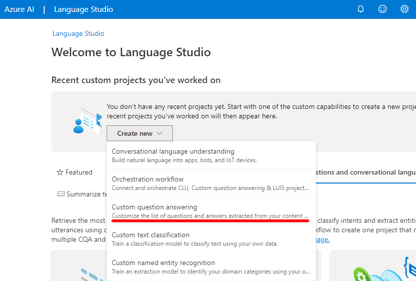
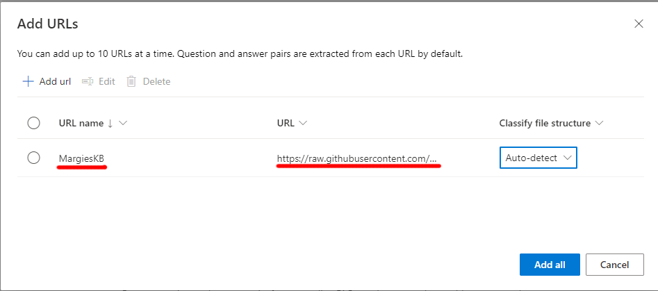

---
lab:
  title: استخدام الإجابة على الأسئلة مع Language Studio
---

# استخدام نموذج الإجابة على الأسئلة مع Language Studio

في هذا التمرين ستستخدم Language Studio لإنشاء وتدريب قاعدة المعارف (KB) من الأسئلة والأجوبة التي سيستخدمها روبوت خدمات العملاء. يأتي محتوى قاعدة المعارف (KB) من صفحة الأسئلة المتداولة الموجودة من موقع Margie's Travel على الويب، وهي وكالة سفر وهمية. ثم ستستخدم Language Studio لمعرفة كيفية عمله عند استخدامه من قبل العملاء.

عند تنفيذ روبوت، فإن الخطوة الأولى هي إنشاء قاعدة المعارف (KB) من أزواج الأسئلة والأجوبة. يتم استخدام هذا جنبا إلى جنب مع قدرات معالجة اللغة الطبيعية المضمنة بحيث يمكن للروبوت تفسير الأسئلة والعثور على الإجابة الأكثر ملاءمة للمستخدم.

تتضمن *Azure الذكاء الاصطناعي Language قدرات الإجابة على الأسئلة*، والتي ستستخدمها لإنشاء قاعدة المعارف (KB). يمكن إنشاء قواعد المعرفة إما عن طريق إدخال أزواج الأسئلة والأجوبة يدويا، أو من مستند موجود أو صفحة ويب موجودة. تريد Margie's Travel استخدام مستند الأسئلة المتداولة الموجود.

تمكنك ميزة الإجابة على الأسئلة في خدمة Language من إنشاء قاعدة المعارف (KB) بسرعة، إما عن طريق إدخال أزواج الأسئلة والأجوبة أو من مستند موجود أو صفحة ويب موجودة. ويمكن بعد ذلك استخدام بعض قدرات معالجة اللغة الطبيعية المدمجة لتفسير الأسئلة والعثور على إجابات مناسبة.

## إنشاء مورد *Language*

لاستخدام الإجابة على الأسئلة، تحتاج إلى **مورد Language** .

1. في علامة تبويب مستعرض أخرى، افتح مدخل Microsoft Azure في [https://portal.azure.com](https://portal.azure.com?azure-portal=true)، وقم بتسجيل الدخول باستخدام حساب Microsoft المقترن باشتراك Azure الخاص بك.

1. **انقر فوق &65291; أنشئ زر مورد** وابحث عن *خدمة* Language. حدد **create** a **Language service** plan. سيتم نقلك إلى صفحة لتحديد **ميزات** إضافية. استخدم الإعدادات التالية:
    - **حدد ميزات** إضافية:
        - **Default features**: *احتفظ بالميزات الافتراضية*.
        - **Custom features**: *حدد custom question answering*.
     - حدد **Continue لإنشاء موردك**
    

1. في الصفحة **Create Language**، حدد الإعدادات التالية:
    - **تفاصيل المشروع**
        - **الاشتراك**: *اشتراك Azure الخاص بك*.
        - **مجموعة الموارد**: *حدد مجموعة موارد موجودة أو أنشئ مجموعة موارد جديدة*.
    - **تفاصيل المثيل**
        - **المنطقة**: *حدد منطقة*      
        - **Name**: *اسم فريد لمورد Language الخاص بك*.
        - **Pricing tier**: S (1000 مكالمة في الدقيقة)
    - **الإجابة عن السؤال المخصص**
        - **Azure search region**: *اختر أي موقع متوفر*.
        - **Azure search pricing tier**: Free F (3 Indexes) - (*إذا لم يكن هذا المستوى متوفرا، فحدد Basic*)
    - **إشعار الذكاء الاصطناعي مسؤول**
        - **By checking this box I certify that I have reviewed and acknowledge the terms in the Responsible AI Notice**: *محدد*.

1. حدد **Review and Create** ثم حدد **Create**. انتظر توزيع خدمة Language التي ستدعم قاعدة المعارف المخصصة للإجابة على الأسئلة.

    > **ملاحظة** إذا وفرت بالفعل موارد **Azure Cognitive Search** في المستوى المجاني، فقد لا تسمح لك حصة الاستخدام بإنشاء مورد آخر. وفي هذه الحالة، حدد مستوى آخر غير **Free F**.

## إنشاء مشروع جديد

1. في علامة تبويب مستعرض جديدة، افتح مدخل Language Studio في [https://language.azure.com](https://language.azure.com?azure-portal=true)، ثم سجل الدخول باستخدام حساب Microsoft المقترن باشتراك Azure.
1. إذا طلب منك اختيار مورد Language، حدد الإعدادات التالية:
    - **دليل** Azure: *دليل Azure الذي يحتوي على اشتراكك*.
    - **اشتراك** Azure: *اشتراك* Azure الخاص بك.
    - **مورد** اللغة: *مورد اللغة الذي قمت بإنشائه مسبقا*.

    إذا ***لم*** تتم مطالبتك باختيار مورد language، فقد يرجع ذلك إلى وجود موارد Language متعددة في اشتراكك؛ وفي هذه الحالة:
    1. في الشريط في الجزء العلوي إذا كانت الصفحة، حدد **الإعدادات (&9881;)**.      
    1. في الصفحة **Settings** اعرض علامة التبويب **Resources**.
    1. حدد مورد اللغة الذي أنشأته للتو، وحدد **تبديل المورد**.
    1. في أعلى الصفحة، حدد **Language Studio** للعودة إلى الصفحة الرئيسية ل Language Studio.

1. في أعلى مدخل Language Studio، في القائمة **Create new**، حدد **Custom question answering**.

    

1. في صفحة **Choose language setting for resource *your resource***، حدد **I want to select the language when I create a project in this resource** وانقر فوق **Next**.
  

1. في الصفحة **Enter basic information** أدخل التفاصيل التالية وانقر فوق **Next**:
    - **Language resource**: *اختر مورد language الخاص بك*.  
    - **Azure search resource**: *اختر مورد بحث Azure الخاص بك*.
    - **الاسم:** `MargiesTravel`
    - **الوصف**: `A simple knowledge base`
    - **Source language**: English
    - **الإجابة الافتراضية عند عدم إرجاع** أي إجابة: `No answer found`
1. في صفحة Review **and finish** ، حدد **Create project**.
1. سيتم نقلك إلى صفحة **Manage sources**. حدد **&65291; أضف المصدر** وحدد **عناوين URL**.
1. في **المربع Add URLs** ، حدد **+ Add url**. اكتب ما يلي وحدد **Add all**:
    - **اسم** URL: `MargiesKB`
    - **URL**: `https://raw.githubusercontent.com/MicrosoftLearning/mslearn-ai-fundamentals/main/data/natural-language/margies_faq.docx`
    - **Classify file structure**: *Auto-detect*
1. حدد **إضافة الكل.**  

 

## تحرير قاعدة المعرفة

تستند قاعدة معرفتك إلى التفاصيل الواردة في وثيقة الأسئلة الشائعة وبعض الردود المحددة مسبقا. يمكنك إضافة أزواج الأسئلة والأجوبة المخصصة لتكملتهم.

1. قم بتوسيع اللوحة اليسرى وحدد **Edit قاعدة المعارف (KB)**. ثم حدد **+** لإضافة زوج سؤال جديد.
1. **في مربع الحوار إضافة زوج** إجابة سؤال جديد، في **نوع `Hello`السؤال** ، وفي **نوع `Hi`الإجابة** ، ثم حدد **تم**.
1. قم بتوسيع **الأسئلة** البديلة وحدد **+ إضافة سؤال** بديل. ثم أدخل `Hiya`كجملة بديلة ل "Hello".
1. في الجزء العلوي من **جزء أزواج إجابات الأسئلة**، حدد **حفظ** لحفظ قاعدة المعارف (KB).

## تدريب واختبار قاعدة المعارف

الآن بعد أن أصبح لديك قاعدة معارف، يمكنك اختبارها.

1. في الجزء العلوي من **جزء Question answer pairs**، حدد **Test** لاختبار قاعدة المعارف (KB).
1. في جزء الاختبار، في الأسفل أدخل الرسالة `Hi`. يجب إرجاع الاستجابة *مرحبا* .
1. في جزء الاختبار، في الأسفل أدخل الرسالة `I want to book a flight`. يجب إرجاع رد مناسب من الأسئلة الشائعة.

    > **ملاحظة** يتضمن الرد *إجابة قصيرة* بالإضافة إلى *مقطع إجابة* مطول أكثر - يظهر مقطع الإجابة النص الكامل في مستند FAQ لأقرب سؤال مطابق، في حين يتم استخراج الإجابة القصيرة بذكاء من المقطع. يمكنك التحكم فيما إذا كانت الإجابة القصيرة واردة من الاستجابة باستخدام خانة الاختيار **«عرض إجابة قصيرة»** أعلى جزء الاختبار.

1. جرب سؤالا آخر، مثل `How can I cancel a reservation?`
1. عند الانتهاء من اختبار قاعدة المعارف (KB)، حدد **Test** لإغلاق جزء الاختبار.

## إنشاء بوت لقاعدة المعرفة

توفر قاعدة المعرفة خدمة خلفية يمكن لتطبيقات العميل استخدامها للإجابة على الأسئلة من خلال نوع من واجهة المستخدم. تطبيقات العميل هذه عادة ما تكون بوت. لجعل قاعدة المعرفة متاحة للبوت، يجب نشرها كخدمة يمكن الوصول إليها عبر HTTP. يمكنك بعد ذلك استخدام خدمة Azure Bot لإنشاء واستضافة برنامج بوت يستخدم قاعدة المعرفة للإجابة على أسئلة المستخدمين.

1. في اللوحة اليسرى، حدد **Deploy قاعدة المعارف (KB)**.
1. في أعلى الصفحة، حدد **Deploy**. سيسألك مربع حوار عما إذا كنت تريد نشر المشروع. حدد **نشر**.

 

1. بعد نشر الخدمة، حدد **Create a bot**. يؤدي هذا إلى فتح مدخل Azure في علامة تبويب مستعرض جديدة حتى تتمكن من إنشاء تطبيق ويب بوت في اشتراك Azure.
1. في مدخل Microsoft Azure، أنشئ **Web App Bot**. (قد ترى رسالة تحذير للتحقق من أن مصدر القالب موثوق به. لا تحتاج إلى اتخاذ أي إجراء لهذه الرسالة.) تابع عن طريق تحديث الإعدادات التالية:

    - **تفاصيل المشروع**
        - **Subscription**: *اشتراكك في Azure*
        - **مجموعة الموارد**: *مجموعة الموارد التي تحتوي على مورد اللغة خاصتك*
    - **تفاصيل المثيل**
        - **موقع مجموعة الموارد**: *نفس موقع خدمة اللغة خاصتك*.
    - **Azure Bot**
        - **مؤشر البوت**: *اسم فريد للبوت خاصتك* (*مملوء مُسبقًا*)
    - **اختر مستوى تسعيرك**
        - **مستوى التسعير**: مجاني (F0) (قد تحتاج إلى تحديد *تغيير الخطة*)
    - **معرَّف تطبيق Microsoft**
        - **نوع** الإنشاء: *حدد **إنشاء هوية مدارة جديدة يعينها المستخدم*** 

5. حدد **التالي** لمتابعة تحديث الإعدادات. 
    - **خدمة التطبيق**
        - **اسم التطبيق**: *نفس **مؤشر البوت** مع **.azurewebsites.net** ملحق تلقائيًا*
        - **لغة SDK**: *اختر إما C# أو Node.js*
    - **خطة App Service**
        - **نوع** الإنشاء: *حدد **إنشاء خطة خدمة تطبيق جديدة***
    - **إعدادات التطبيق**
        - **مفتاح** مورد اللغة: *ستحتاج إلى نسخ مفتاح مورد اللغة ولصقه هنا*:
            - افتح علامة تبويب مستعرض أخرى وانتقل إلى مدخل Microsoft Azure في [https://portal.azure.com](https://portal.azure.com?azure-portal=true).
            - استعرض للوصول إلى مورد خدمة Language.
            - في **صفحة المفاتيح ونقطة** النهاية، انسخ أحد المفاتيح
            - ألصقه هنا.
        - **اسم مشروع اللغة**: MargiesTravel
        - **اسم مضيف نقطة نهاية خدمة اللغة**: *تم مملوء مسبقًا بنقطة نهاية خدمة اللغة*
    - **تفاصيل خدمة اللغة**
        - **معرّف الإشتراك**: *مملوء مسبقًا بمعرّف اشتراكك*
        - **اسم مجموعة الموارد**: *مملوء مسبقًا باسم مجموعة مواردك*
        - **اسم الحساب**: *تم ملوء مسبقًا باسم موردك*

1. حدد **إنشاء**. ثم انتظر حتى يتم إنشاء الروبوت الخاص بك (أيقونة الإعلام في الجزء العلوي الأيمن، والتي تبدو وكأنها جرس، سيتم تحريكها أثناء الانتظار). ثم في الإعلام باكتمال النشر، حدد **Go to resource** (أو بدلا من ذلك، في الصفحة الرئيسية، انقر فوق **Resource groups**، وافتح مجموعة الموارد حيث أنشأت الروبوت، وحدد **مورد Azure bot** .)
1. في الجزء الأيسر من الروبوت الخاص بك ابحث عن **الإعدادات**، حدد على **Test in Web Chat**، وانتظر حتى يعرض الروبوت الرسالة **Hello and Welcome** (قد يستغرق الأمر بضع ثوان للتهيئة).
1. استخدم واجهة الدردشة الاختبارية لضمان أن يجيب البوت الخاص بك على الأسئلة من قاعدة معرفتك كما هو متوقع. على سبيل المثال، حاول إرسال `I need to cancel my hotel`.

تجربة مع بوت. ربما ستجد أنه يمكنه الإجابة على أسئلة ضمن الأسئلة الشائعة بدقة تامة، ولكن سيكون لديه قدرة محدودة على تفسير الأسئلة التي لم يتم تدريبه عليها. يمكنك دائما استخدام Language Studio لتحرير قاعدة المعارف لتحسينها، وإعادة نشرها.

## تنظيف

إذا كنت لا تنوي إجراء المزيد من التدريبات، فاحذف أي موارد لم تعد بحاجة إليها. وهذا يتجنب تراكم أي تكاليف غير ضرورية.

1. افتح مدخل  Microsoft Azure وحدد مجموعة الموارد التي تحتوي على المورد الذي أنشأته. 
1. حدد المورد وحدد **حذف** ثم **نعم** للتأكيد. ثم يتم حذف المورد.

## معرفة المزيد

- لمعرفة المزيد عن خدمة Question Answering، راجع [الوثائق](https://docs.microsoft.com/azure/cognitive-services/language-service/question-answering/overview).
- لمعرفة المزيد حول خدمة بوت Microsoft، اعرض [صفحة خدمة Azure Bot](https://azure.microsoft.com/services/bot-service/).
