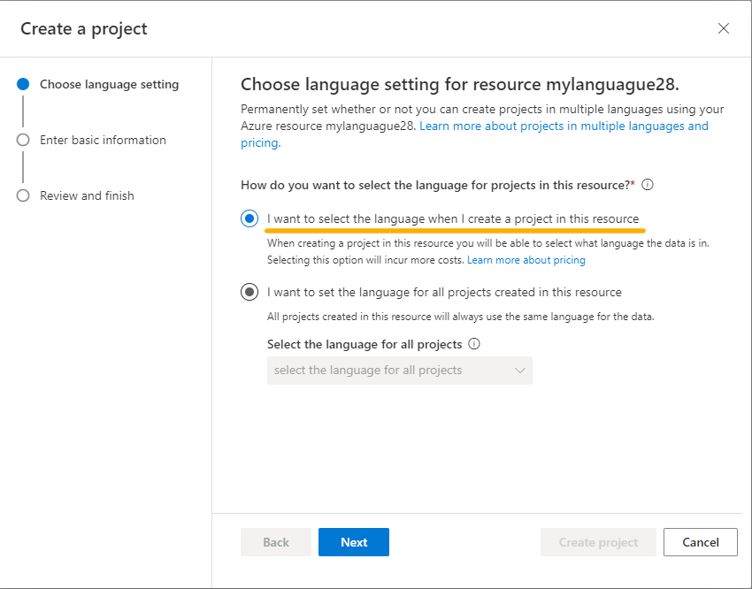

---
lab:
  title: استخدم الإجابة على الأسئلة مع Language Studio
---

# استخدم الإجابة على الأسئلة مع Language Studio

في هذا التمرين، ستستخدم Language Studio لإنشاء قاعدة معرفية من الأسئلة والأجوبة وتدريبها. سيأتي محتوى قاعدة المعرفة من صفحة الأسئلة المتداولة الحالية من موقع Margie’s Travel على الويب، وهي وكالة سفر وهمية. ثم ستستخدم Language Studio لمعرفة كيفية عملها عند استخدامها بواسطة العملاء.

تشتمل خدمة Azure AI Language على إمكانات *الإجابة على الأسئلة*، والتي ستستخدمها لإنشاء قاعدة معرفية. يمكن إنشاء قواعد المعرفة إما من خلال إدخال أزواج الأسئلة والأجوبة يدويًا، أو من مستند أو صفحة ويب موجودة. تريد Margie's Travel استخدام مستند الأسئلة المتداولة الموجود لديهم.

تتيح لك ميزة الإجابة على الأسئلة من خدمة اللغة إنشاء قاعدة معارف بسرعة، إما بإدخال أزواج الأسئلة والأجوبة أو من مستند موجود أو صفحة ويب. ويمكن بعد ذلك استخدام بعض قدرات معالجة اللغة الطبيعية المدمجة لتفسير الأسئلة والعثور على إجابات مناسبة.

## إنشاء مورد *Language*

لاستخدام الإجابة على الأسئلة، تحتاج إلى مورد **لغة**.

1. في علامة تبويب المستعرض، افتح مدخل Azure على [https://portal.azure.com](https://portal.azure.com?azure-portal=true)، وسجل الدخول باستخدام حساب Microsoft المرتبط باشتراكك في Azure.

1. انقر فوق زر **&#65291;إنشاء مورد** وابحث عن *خدمة اللغة*. حدد **إنشاء** خطة **خدمة اللغة**. سيتم نقلك إلى صفحة **لتحديد ميزات إضافية**. استخدم الإعدادات التالية:
    - **تحديد ميزات إضافية**:
        - **Default features**: *احتفظ بالميزات الافتراضية*.
        - **Custom features**: *حدد custom question answering*.
     - حدد **متابعة لإنشاء المورد الخاص بك**
    

1. في الصفحة **Create Language**، حدد الإعدادات التالية:
    - **تفاصيل المشروع**
        - **الاشتراك**: *اشتراك Azure الخاص بك*.
        - **مجموعة الموارد**: *حدد مجموعة موارد موجودة أو أنشئ مجموعة موارد جديدة*.
    - **تفاصيل المثيل**
        - **المنطقة**: *حدد منطقة. إذا كنت في شرق الولايات المتحدة، فاستخدم "شرق الولايات المتحدة 2"*      
        - **Name**: *اسم فريد لمورد Language الخاص بك*.
        - **Pricing tier**: S (1000 مكالمة في الدقيقة)
    - **الإجابة عن السؤال المخصص**
        - **Azure search region**: *اختر أي موقع متوفر*.
        - **مستوى الأسعار الخاص ببحث Azure**: F مجاني (3 فهارس) - (*إذا لم يكن هذا المستوى متاحًا، فاختَر Basic*)
    - **إشعار الذكاء الاصطناعي المسؤول**
        - **By checking this box I certify that I have reviewed and acknowledge the terms in the Responsible AI Notice**: *محدد*.

1. حدد **مراجعة وإنشاء**، ثم حدد **إنشاء**. انتظر توزيع خدمة Language التي ستدعم قاعدة المعارف المخصصة للإجابة على الأسئلة.

    > **ملاحظة** إذا وفرت بالفعل موارد **Azure Cognitive Search** في المستوى المجاني، فقد لا تسمح لك حصة الاستخدام بإنشاء مورد آخر. وفي هذه الحالة، حدد مستوى آخر غير **Free F**.

## إنشاء مشروع جديد

1. في علامة تبويب مستعرض جديدة، افتح مدخل Language Studio في [https://language.azure.com](https://language.azure.com?azure-portal=true)، ثم سجل الدخول باستخدام حساب Microsoft المقترن باشتراك Azure.
1. إذا طلب منك اختيار مورد Language، حدد الإعدادات التالية:
    - **دليل Azure**: *دليل Azure الذي يحتوي على اشتراكك*.
    - **اشتراك Azure**: *اشتراكك في Azure*.
    - **مورد اللغة**: *مورد اللغة الذي قمتَ بإنشائه مسبقًا*.

    إذا ***لم*** تتم مطالبتك باختيار مورد language، فقد يرجع ذلك إلى وجود موارد Language متعددة في اشتراكك؛ وفي هذه الحالة:
    1. في الشريط في الجزء العلوي إذا كانت الصفحة، حدد **الإعدادات (&#9881;)**.      
    1. في الصفحة **Settings** اعرض علامة التبويب **Resources**.
    1. حدد مورد اللغة الذي أنشأته للتو، وانقر فوق **مورد الانتقال**.
    1. في أعلى الصفحة، انقر فوق **Language Studio** للعودة إلى الصفحة الرئيسية في Language Studio.

1. في أعلى مدخل Language Studio، في القائمة **Create new**، حدد **Custom question answering**.

    

1. في صفحة **Choose language setting for resource *your resource***، حدد **I want to select the language when I create a project in this resource** وانقر فوق **Next**.
  

1. في الصفحة **Enter basic information** أدخل التفاصيل التالية وانقر فوق **Next**:
    - **Language resource**: *اختر مورد language الخاص بك*.  
    - **Azure search resource**: *اختر مورد بحث Azure الخاص بك*.
    - **الاسم:** `MargiesTravel`
    - **الوصف**: `A simple knowledge base`
    - **Source language**: English
    - **الإجابة الافتراضية عند عدم إرجاع أي إجابة**: `No answer found`
1. في صفحة **مراجعة وإنهاء**، حدد **إنشاء مشروع**.
1. سيتم نقلك إلى صفحة **Manage sources**. حدد **&#65291;Add source** وحدد **عناوين URL**.
1. في المربع **إضافة عناوين URL**، حدد **+ إضافة عنوان url**. اكتب ما يلي وحدد **Add all**:
    - **اسم URL**: `MargiesKB`
    - **URL**: `https://raw.githubusercontent.com/MicrosoftLearning/mslearn-ai-fundamentals/main/data/natural-language/margies_faq.docx`
    - **Classify file structure**: *Auto-detect*
1. حدد **إضافة الكل.**  

 

## تحرير قاعدة المعرفة

تستند قاعدة معرفتك إلى التفاصيل الواردة في وثيقة الأسئلة الشائعة وبعض الردود المحددة مسبقا. يمكنك إضافة أزواج الأسئلة والأجوبة المخصصة لتكملتهم.

1. قم بتوسيع اللوحة اليسرى وتحديد **تحرير قاعدة المعارف**. ثم حدد **+** لإضافة زوج أسئلة جديد.
1. في مربع الحوار **إضافة زوج إجابات جديد على الأسئلة**، وفي نوع **السؤال**، `Hello`وفي نوع **الإجابة**، `Hi`حدد **تم**.
1. قم بتوسيع **الأسئلة البديلة** وحدد **+ إضافة سؤال بديل**. ثم أدخِل `Hiya`كجملة بديلة لكلمة "مرحبًا".
1. في الجزء العلوي من جزء **أزواج الإجابات على الأسئلة**، حدد **حفظ** لحفظ قاعدة المعرفة الخاصة بك.

## تدريب واختبار قاعدة المعارف

الآن بعد أن أصبح لديك قاعدة معارف، يمكنك اختبارها.

1. في الجزء العلوي من جزء **أزواج الإجابات على الأسئلة**، حدد **اختبار** لاختبار قاعدة المعرفة الخاصة بك.
1. في جزء الاختبار، أدخل في الجزء السفلي رسالة تقول `Hi`. يجب أن تتم الاستجابة لقولك *مرحبًا*.
1. في جزء الاختبار، أدخل في الجزء السفلي رسالة تقول `I want to book a flight`. يجب إرجاع رد مناسب من الأسئلة الشائعة.

    > **ملاحظة** يتضمن الرد *إجابة قصيرة* بالإضافة إلى *مقطع إجابة* مطول أكثر - يظهر مقطع الإجابة النص الكامل في مستند FAQ لأقرب سؤال مطابق، في حين يتم استخراج الإجابة القصيرة بذكاء من المقطع. يمكنك التحكم فيما إذا كانت الإجابة القصيرة واردة من الاستجابة باستخدام خانة الاختيار **«عرض إجابة قصيرة»** أعلى جزء الاختبار.

1. جرّب سؤالاً آخر، مثل `How can I cancel a reservation?`
1. عند الانتهاء من اختبار قاعدة المعرفة، حدد **اختبار** لإغلاق جزء الاختبار.

## نشر مشروعك

بإمكانك توزيع قاعدة المعارف (KB) كتطبيق عميل للإجابة على الأسئلة.

1. في اللوحة اليسرى، حدد **نشر قاعدة المعارف**.
1. في أعلى الصفحة، حدد **نشر**. سيسألك مربع حوار عما إذا كنت تريد نشر المشروع. حدد **نشر**.

 

## تنظيف

إذا كنت لا تنوي إجراء المزيد من التدريبات، فاحذف أي موارد لم تعد بحاجة إليها. وهذا يتجنب تراكم أي تكاليف غير ضرورية.

1. افتح [مدخل Azure]( https://portal.azure.com) وحدد مجموعة الموارد التي تحتوي على المورد الذي أنشأته. 
1. حدد المورد وحدد **حذف** ثم **نعم** للتأكيد. من ثم يتم حذف المورد.

## معرفة المزيد

- لمعرفة المزيد عن خدمة Question Answering، راجع [الوثائق](https://docs.microsoft.com/azure/cognitive-services/language-service/question-answering/overview).
