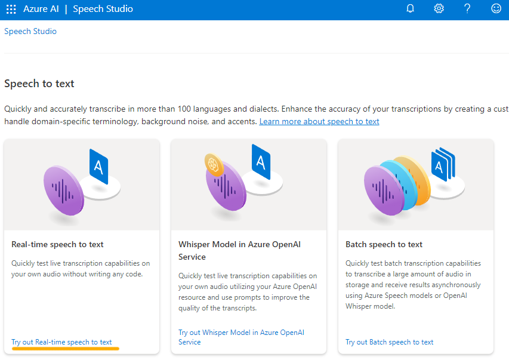

---
lab:
  title: خدمة استكشاف Speech Studio
---

# خدمة استكشاف Speech Studio

تنسخ **خدمة Azure الذكاء الاصطناعي Speech** الكلام إلى نص، والنص إلى كلام مسموع. يمكنك استخدام الذكاء الاصطناعي Speech لإنشاء تطبيق يمكنه نسخ ملاحظات الاجتماع أو إنشاء نص من تسجيل المقابلات.

في هذا التمرين، ستجرب قدرات Azure الذكاء الاصطناعي Speech باستخدام Azure الذكاء الاصطناعي Speech Studio. 

## *إنشاء مورد Azure الذكاء الاصطناعي Speech*

يمكنك استخدام خدمة "الكلام" عن طريق إنشاء إما مورد **الكلام** أو مورد **خدمات الكلام بالذكاء الاصطناعي في Azure**.

في هذا التمرين، ستقوم بإنشاء مورد الذكاء الاصطناعي Speech، ما لم يكن لديك بالفعل مورد يمكنك استخدامه.

1. في علامة تبويب مستعرض أخرى، افتح [Azure الذكاء الاصطناعي Speech Studio](https://speech.microsoft.com/)، وقم بتسجيل الدخول باستخدام حساب Microsoft الخاص بك.

1. حدد **الإعدادات** ثم **إنشاء مورد.** قم بتكوينه بالإعدادات التالية:
    - **اسم المورد** الجديد: *أدخل اسما* فريدا.
    - **الاشتراك**: *اشتراك Azure الخاص بك*.
    - **المنطقة**: *حدد [منطقة](https://learn.microsoft.com/azure/ai-services/speech-service/regions)* مدعومة.
    - **مستوى** التسعير: *FO مجاني (إذا كان متوفرا، وإلا حدد Standard S0).*
    - **مجموعة الموارد**: *أنشئ مجموعة موارد جديدة ذات اسم فريد*.
1. حدد **إنشاء مورد**. انتظر حتى يتم إنشاء المورد ثم حدد **استخدام المورد**. يتم عرض صفحة بدء استخدام الكلام.

## استكشاف الكلام إلى النص في Speech Studio

1. حدد [**https://aka.ms/mslearn-speech-files](https://aka.ms/mslearn-speech-files)** لتنزيل **speech.zip.** افتح المجلد. 

1. في صفحة بدء استخدام الكلام، ضمن *تحويل الكلام إلى نص* ، ابحث عن *تحويل الكلام إلى نص* في الوقت الحقيقي. حدد **جرب تحويل الكلام إلى نص** في الوقت الحقيقي.

    

1. ضمن *اختيار ملفات* صوتية، حدد **استعراض الملفات** وانتقل إلى المجلد حيث قمت بحفظ الملف. حدد **WhatAICanDo.m4a** ثم **فتح**.

    

1. تنسخ خدمة Speech النص وتعرضه في الوقت الفعلي. إذا كان لديك صوت على الكمبيوتر، يمكنك الاستماع إلى التسجيل أثناء نسخ النص.
1. راجع الإخراج، الذي كان يجب أن يتعرف على الصوت وينسخه بنجاح في النص.

    > **ملاحظة** إذا تلقيت رسالة خطأ، فانتظر بضع دقائق قبل المحاولة مرة أخرى. يستغرق الأمر بعض الوقت حتى يتوفر مورد الكلام للاستخدام الأول.

في هذا التمرين، قمت بإنشاء مورد الذكاء الاصطناعي Speech في Speech Studio. ثم استخدمت خدمة تحويل الكلام إلى نص في الوقت الحقيقي لنسخ تسجيل صوتي. كنت قادرا على رؤية كتابة النص الذي يتم إنشاؤه أثناء تشغيل الملف الصوتي.

## تنظيف

إذا كنت لا تنوي إجراء المزيد من التدريبات، فاحذف أي موارد لم تعد بحاجة إليها. وهذا يتجنب تراكم أي تكاليف غير ضرورية.

1. افتح مدخل  Microsoft Azure وحدد مجموعة الموارد التي تحتوي على المورد الذي أنشأته.
1. حدد المورد وحدد **حذف** ثم **نعم** للتأكيد. ثم يتم حذف المورد.

## معرفة المزيد

أظهر هذا التمرين فقط بعض قدرات خدمة Speech. لمعرفة المزيد حول ما يمكنك القيام به باستخدام هذه الخدمة، راجع [صفحة الكلام](https://azure.microsoft.com/services/cognitive-services/speech-services).
