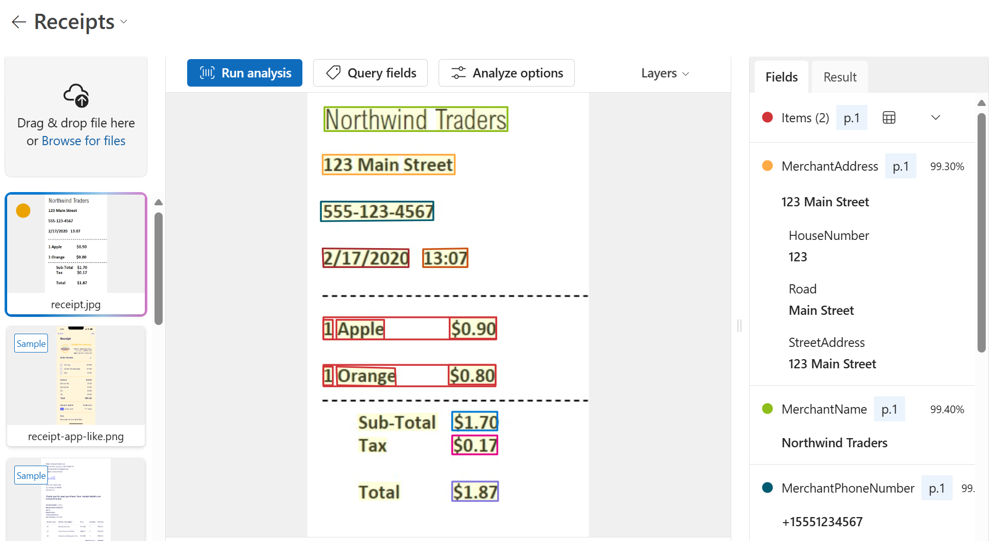

---
lab:
  title: استخراج البيانات من المستندات في مدخل Azure AI Foundry
---

# استخراج البيانات من المستندات في مدخل Azure AI Foundry

تتيح لك خدمة **ذكاء المستندات باستخدام الذكاء الاصطناعي في Azure** تحليل المعلومات واستخراجها من النماذج والمستندات، ثم تحديد أسماء الحقول والبيانات. 

كيف يعتمد Document Intelligence على التعرف البصري على الحروف (OCR)؟ بينما يمكن لـ OCR قراءة المستندات المطبوعة أو المكتوبة بخط اليد، يستخرج التعرف البصري على الحروف النص بتنسيق غير منظم يصعب تخزينه في قاعدة بيانات أو تحليله. يساعد ذكاء المستندات على فهم البيانات غير المنظمة من خلال التقاط بنية النص، مثل حقول البيانات والمعلومات الموجودة في الجداول. 

في هذا التمرين، ستستخدم النماذج المعدة مسبقًا من ذكاء المستندات باستخدام الذكاء الاصطناعي في Azure في مدخل Azure AI Foundry، وهي منصة Microsoft لإنشاء التطبيقات الذكية، للتعرف على البيانات من استلام. 

## إنشاء مشروع في مدخل Azure AI Foundry

دعنا نبدأ بإنشاء مشروع في مصنع الذكاء الاصطناعي في Azure.

1. في متصفح الويب، افتح [مدخل Azure AI Foundry](https://ai.azure.com) على `https://ai.azure.com` وسجّل الدخول باستخدام بيانات اعتماد Azure الخاصة بك. أغلق أي تلميحات أو أجزاء التشغيل السريع يتم فتحه عندما تقوم بتسجيل الدخول لأول مرة، وإذا لزم الأمر،استخدم شعار **Azure AI Foundry** في أعلى اليسار للانتقال إلى الصفحة الرئيسية، والتي تبدو مشابهة للصورة التالية (أغلق جزء **المساعدة** إذا كان مفتوحًا):

    

1. في الصفحة الرئيسية، حدد **+ إنشاء وكيل**.

1. في معالج **إنشاء وكيل**، أدخل اسمًا صالحًا لمشروعك. 

1. حدد **الخيارات المتقدمة** وحدد الإعدادات التالية:
    - **مورد Azure AI Foundry**: *احتفظ بالاسم الافتراضي*
    - **Subscription**: *اشتراكك في Azure*
    - **Resource group**: *إنشاء مجموعة موارد أو تحديدها*
    - **المنطقة**: حدد أحد المواقع التالية:
        * شرق الولايات المتحدة
        * وسط فرنسا
        * وسط كوريا
        * أوروبا الغربية
        * غرب الولايات المتحدة

1. حدد **إنشاء** وراجع تكوينك. انتظر حتى تكتمل عملية الإعداد.

    >**ملاحظة**: إذا تلقيت خطأ في الأذونات، فحدد زر **إصلاحه** لإضافة الأذونات المناسبة للمتابعة.

1. عند إنشاء مشروعك، سيتم نقلك افتراضيًا إلى بيئة الوكلاء في مدخل Azure AI Foundry، والتي يجب أن تبدو مشابهة للصورة التالية:

    

1. في نافذة متصفح جديدة، افتح [صفحة استكشاف خدمات الذكاء الاصطناعي في Azure](https://ai.azure.com/explore/aiservices).

1. في صفحة *خدمات الذكاء الاصطناعي*، حدد لوحة *الرؤية + المستند* لتجربة إمكانات المستندات والرؤية من الذكاء الاصطناعي في Azure

## تحليل استلام باستخدام ذكاء المستندات باستخدام الذكاء الاصطناعي في Azure في Azure AI Foundry 

أنت الآن جاهز لتحليل إيصال لشركة البيع بالتجزئة في Northwind Traders الوهمية.

1. في صفحة *الرؤية + المستند*، مرّر لأسفل وحدد **المستند**. تحت *النماذج المعدة مسبقًا لمستندات محددة*، حدد لوحة **الاستلامات**.

1. في القائمة المنسدلة ضمن *جربه*، لاحظ أنه تم تحديد مورد خدمات الذكاء الاصطناعي في Azure الخاص بك. اتركه كما هو.

1. على حاسوبك، استخدم [**https://aka.ms/mslearn-receipt**](https://aka.ms/mslearn-receipt) لفتح صورة نموذجية لاستلام. احفظه في مجلد التنزيلات أو على سطح المكتب. 
 
1. في Azure AI Foundry، في صفحة *الاستلامات*، حدد **تصفح الملفات** وانتقل إلى المجلد حيث حفظت الصورة. حدد صورة الإيصال ثم **فتح**. تظهر الصورة على الجانب الأيمن من الشاشة.

    

1. على اليمين، حدد **تشغيل التحليلات**.

1. عند تشغيل التحليل، يتم إرجاع النتائج. لاحظ أن الخدمة تعرفت على حقول بيانات محددة مثل اسم التاجر والعنوان ورقم الهاتف وتاريخ المعاملة ووقتها، بالإضافة إلى البنود والإجمالي الفرعي والضريبة والمبالغ الإجمالية. بجوار كل حقل توجد نسبة احتمالية أن يكون الحقل صحيحًا.

    

في هذا التمرين، استخدمت نموذج الاستلامات المُعد مسبقًا لذكاء المستندات باستخدام الذكاء الاصطناعي في Azure في مدخل Azure AI Foundry. من النتائج التي تم إرجاعها، رأيت كيف تمكنت Document Intelligence من تحديد حقول معينة، مما يتيح معالجة البيانات من المستندات اليومية بسهولة أكبر. قبل إغلاق العرض التوضيحي، لماذا لا تجرب بعض الاستلامات النموذجية، بما في ذلك تلك الموجودة بلغات مختلفة؟

## تنظيف

إذا كنت لا تنوي إجراء المزيد من التدريبات، فاحذف أي موارد لم تعد بحاجة إليها. وهذا يتجنب تراكم أي تكاليف غير ضرورية.

1. افتح [مدخل Azure]( https://portal.azure.com) وحدد مجموعة الموارد التي تحتوي على المورد الذي أنشأته.
1. حدد المورد وحدد **حذف** ثم **نعم** للتأكيد. من ثم يتم حذف المورد.

## معرفة المزيد

أظهر هذا التمرين فقط بعض قدرات خدمة الذكاء الاصطناعي Document Intelligence. للتعّرف على المزيد حول ما يمكنك القيام به مع هذه الخدمة، يرجى مراجعة[صفحة Document Intelligence](https://learn.microsoft.com/azure/ai-services/document-intelligence/overview?view=doc-intel-3.1.0).
