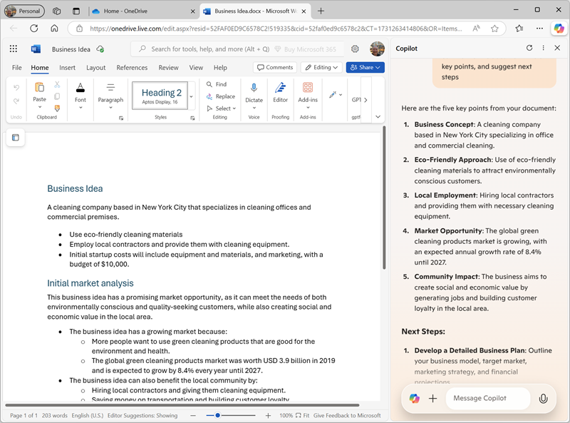
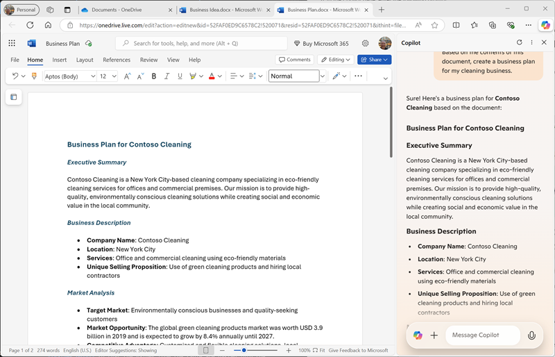

---
lab:
  title: استكشاف Copilot في Microsoft Edge
---
# استكشاف Microsoft Copilot في Microsoft Edge

في هذا التمرين، ستستكشف بعض الطرق التي يمكن من خلالها ل Microsoft Copilot استخدام الذكاء الاصطناعي التوليدية لمساعدتك على أن تكون أكثر إنتاجية عند إنشاء محتوى جديد. في سيناريو هذا التمرين، ستبدأ ببعض الملاحظات عالية المستوى لفكرة الأعمال، وتستخدم Copilot في Microsoft Edge لمساعدتك في تطوير خطة عمل وعرض تقديمي للمستثمرين المحتملين.

يجب أن يستغرق هذا التمرين حوالي **40** دقيقة لإكماله.

> **ملاحظة**: يفترض هذا التمرين أن لديك [حساب](https://signup.live.com) Microsoft شخصي (مثل حساب outlook.com) الذي قمت بتسجيل الدخول به إلى [Microsoft Edge](https://www.microsoft.com/edge/download) على الكمبيوتر الخاص بك.

## استخدام Copilot لاستكشاف مستند والبحث عن فكرة

لبدء استكشافك الذكاء الاصطناعي التوليدية، دعنا نستخدم Microsoft Copilot في Edge لفحص مستند موجود واستخراج بعض الرؤى منه.

1. في Microsoft Edge، استعرض للوصول إلى [OneDrive](https://onedrive.live.com) في `https://onedrive.live.com` وسجل الدخول باستخدام حساب Microsoft الشخصي الخاص بك - أغلق أي رسائل ترحيب أو عروض يتم عرضها.
1. في علامة تبويب مستعرض أخرى، افتح المستند [Business Idea.docx](https://github.com/MicrosoftLearning/mslearn-ai-fundamentals/raw/main/data/generative-ai/Business%20Idea.docx) من `https://github.com/MicrosoftLearning/mslearn-ai-fundamentals/raw/main/data/generative-ai/Business%20Idea.docx`. بعد ذلك، عند فتح المستند في Edge، حدد خيار **حفظ نسخة إلى OneDrive** وحفظ المستند في **مجلد المستندات** في OneDrive. يجب أن يفتح المستند في Microsoft Word عبر الإنترنت تلقائيا.

    > **تلميح**: إذا لم تتمكن من رؤية خيار حفظ نسخة من الملف إلى OneDrive، فبادر بتنزيلها على الكمبيوتر المحلي. بعد ذلك، في OneDrive، افتح **مجلد المستندات** واستخدم **الزر + إضافة جديد** لتحميل **ملف الأعمال Idea.docx** من الكمبيوتر المحلي إلى OneDrive.

1. عرض النص في **Idea.docx** الأعمال، الذي يصف بعض الأفكار عالية المستوى لإدارة أعمال التنظيف في مدينة نيويورك.
1. استخدم أيقونة **Copilot** على شريط أدوات Edge لفتح جزء Copilot، كما هو موضح هنا:

    

1. في جزء Copilot، قم بالتمرير لأسفل لرؤية جميع المحتويات حسب الضرورة، وتأكد من **تحديد علامة التبويب Chat** وتعيين نمط المحادثة إلى **More Balanced** - وهذا سيضمن استجابة Copilot بتوازن بين الإبداع والدقة الواقعية.
1. في مربع الدردشة في أسفل جزء Copilot، أدخل التالية المطالبة:

    ```
    What is this document about?
    ```

    إذا طلب منك ذلك، فتأكد من رغبتك في السماح ل Copilot بالوصول إلى الصفحة.

1. راجع الاستجابة من Copilot، والتي يجب أن تلخص النقاط الرئيسية في المستند، كما هو موضح هنا:

    

    > **ملاحظة**: قد تختلف الاستجابة المحددة.

1. أدخل المطالبة التالية:

    ```
    How do I go about setting up a business in New York?
    ```

1. راجع الاستجابة، التي يجب أن تحتوي على بعض النصائح والروابط إلى المورد لمساعدتك على البدء في إنشاء شركة في نيويورك، وقد تتضمن بعض مطالبات المتابعة المقترحة للحصول على مزيد من المعلومات.

    > **هام**: تستند الاستجابة التي تم إنشاؤها الذكاء الاصطناعي إلى معلومات عامة على الويب. في حين أنه قد يكون من المفيد مساعدتك على فهم الخطوات المطلوبة لإنشاء عمل تجاري، فإنه ليس من المضمون أن تكون دقيقة بنسبة 100٪ ولا تحل محل الحاجة إلى المشورة المهنية!

## استخدام Copilot لإنشاء محتوى لخطة عمل

الآن بعد أن قمت ببعض الأبحاث الأولية، دعنا نساعدك Copilot على وضع خطة عمل لشركة التنظيف الخاصة بك.

1. **مع استمرار فتح مستند Idea.docx** الأعمال في Microsoft Edge، في جزء Copilot، أدخل المطالبة التالية:

    ```
    Suggest a name for my cleaning business
    ```

1. راجع الاقتراحات وحدد اسما لشركة التنظيف (أو تابع المطالبة بالعثور على الاسم الذي تريده).
1. أدخل المطالبة التالية، واستبدل *Contoso Cleaning* باسم الشركة الذي تختاره:

    ```
    Write a business plan for "Contoso Cleaning" based on the information in this document. Include an executive summary, market overview, and financial projections.
    ```

1. راجع الاستجابة، وضمن الإخراج استخدم أيقونة **نسخ** (#128461;) لنسخها إلى الحافظة. ثم حدد كل النص في **المستند Ideas.docx** الأعمال والصق النص المنسوخ في المستند لاستبداله. وأخيرا، قم بترتيب النص الملصق عن طريق استبدال النص الأولي في الاستجابة (التي أقر فيها Copilot بالإرشادات) بعنوان لاسم شركة التنظيف. يجب أن ينتهي بك الأمر بمستند خطة عمل، على غرار ما يلي:

    

1. في جزء Copilot، أدخل المطالبة التالية:

    ```
    Create a corporate logo for the cleaning company. The logo should be round and include an iconic New York landmark.
    ```

1. راجع الاستجابة، التي يجب أن تقدم أربعة خيارات لشعار تم إنشاؤه بواسطة المصمم من Microsoft.
1. استخدم المزيد من المطالبات للتكرار على التصميم (على سبيل المثال، `Make it green and blue`) حتى يكون لديك شعار سعيد به.
1. انقر بزر الماوس الأيمن فوق تصميم الشعار الذي تفضله وانسخه إلى الحافظة. ثم الصقه في الجزء العلوي من مستند خطة العمل، مثل هذا:

    

1. أغلق علامة التبويب Microsoft Word وارجع إلى **مجلد المستندات** في OneDrive.

## استخدام Copilot لإنشاء محتوى لعرض تقديمي

بمساعدة Copilot، قمت بإنشاء مسودة خطة عمل لفكرة أعمال التنظيف. ستحتاج الآن إلى عرض تقديمي فعال لإقناع المستثمر بإقراضك التمويل لبدء العمل.

1. في **مجلد المستندات** في OneDrive، أضف عرضا تقديميا** جديدا **في PowerPoint.

    **إذا تم فتح جزء Designer** تلقائيا، فقم بإغلاقه.

1. في شريحة العنوان للعرض التقديمي، أدخل اسم شركة التنظيف كعنوان، وكمكتب `Investor Opportunity` الترجمة.
1. أضف شريحة جديدة، باستخدام تخطيط الشريحة **"محتوىان** " (الذي يتضمن عنوانا واثنين من العناصر النائبة للمحتوى).
1. تغيير عنوان الشريحة إلى `Benefits of Hiring a Commercial Cleaner`.
1. في جزء Copilot، أدخل المطالبة التالية:

    ```
    Write a summary of the benefits of using a corporate cleaning company for your business. The summary should consist of five short bullet points.
    ```

1. انسخ استجابة Copilot إلى الحافظة، والصقها في العنصر النائب للمحتوى الأيسر. ثم احذف الجملة الأولية التي تعترف بالطلب ثم أعد تنسيق النص في العنصر النائب حتى يتم الوفاء بك.
1. في جزء Copilot، أدخل المطالبة التالية:

    ```
    Create a photorealistic image of a clean office.
    ```

1. عندما ينشئ Copilot صورة تريدها، انسخها إلى الحافظة والصقها في العنصر النائب للمحتوى على يمين الشريحة.

    **إذا تم فتح جزء Designer** تلقائيا، فحدد تصميم شريحة تريده. ثم أغلق جزء **Designer** .

1. تطبيق أي إعادة تنسيق إضافية تعتقد أنها مطلوبة حتى يكون لديك شريحة تبدو مشابهة لهذا:

    

1. في شريط عنوان PowerPoint، حدد اسم العرض التقديمي الافتراضي (**عرض تقديمي**) وأعد تسميته إلى `Business Presentation.pptx`.
1. أغلق علامة التبويب PowerPoint وارجع إلى **مجلد المستندات** في OneDrive.

## استخدام Copilot لإنشاء رسالة بريد إلكتروني

لقد أنشأت بعض الضمانات لمساعدتك في بدء عملك. حان الوقت الآن للتواصل مع مستثمر يبحث عن بعض تمويل الشركات الناشئة.

1. **استخدم مشغل التطبيق** في الطرف الأيمن من شريط عنوان OneDrive لفتح **Outlook**.
1. قم بإنشاء بريد إلكتروني جديد، واملأ **المربع إلى** بعنوان بريدك الإلكتروني الخاص.
1. في جزء Copilot، حدد **علامة التبويب إنشاء** . ثم قم بتعيين الخيارات التالية لإنشاء محتوى جديد:
    - **الكتابة عن**: `Request a meeting with an investment bank to discuss funding for a commercial cleaning business.`
    - **نغمة**: محترف
    - **التنسيق**: البريد الإلكتروني
    - **الطول**: متوسط
1. حدد **Generate draft**، وراجع الإخراج الذي تم إنشاؤه.
1. استخدم المحتوى الذي تم إنشاؤه لإكمال بريدك الإلكتروني، كما هو موضح هنا:

    

    يمكنك إرسال البريد الإلكتروني إلى نفسك إذا كنت ترغب في ذلك!

## التحدي

لقد رأيت الآن كيفية استخدام Copilot للبحث عن الأفكار وتوليد المحتوى، لماذا لا تحاول استكشاف المزيد؟ لبدء جلسة عمل Copilot جديدة، في **علامة التبويب دردشة** ، حدد **أيقونة موضوع** جديد بجوار مربع المطالبة، ثم حاول استخدام Copilot لتخطيط حدث لتعزيز محو أمية الأطفال في مكتبة محلية. تتضمن بعض الأشياء التي يمكنك تجربتها ما يلي:

- ابحث عن بعض النصائح لتشجيع الأطفال على القراءة في سن مبكرة.
- إنشاء نشرة إعلانية أو ملصق للحدث.
- قم بإنشاء رسالة بريد إلكتروني لحملة لدعوة كتاب الأطفال المحليين للحضور والتحدث في الحدث.
- إنشاء عرض تقديمي لبدء الحدث.

كن مبتكرا كما تريد، واستكشف كيف يمكن ل Copilot مساعدتك من خلال العثور على المعلومات، وإنشاء النصوص وتحسينها، وإنشاء الصور، والإجابة على الأسئلة.


## الخاتمة

في هذا التمرين، استخدمت Copilot في Microsoft Edge للعثور على المعلومات وإنشاء المحتوى. نأمل أن تكون قد رأيت كيف يمكن أن يساعد استخدام الذكاء الاصطناعي التوليدية في copilot في الإنتاجية والإبداع.

في حين أن الخدمات المجانية المستخدمة في هذه التدريبات قوية جدا بلا شك، يمكنك تحقيق المزيد من خلال خدمات مثل [Copilot ل Microsoft 365](https://www.microsoft.com/microsoft-365/enterprise/copilot-for-microsoft-365)، حيث يتم دمج Microsoft Copilot في تطبيقات إنتاجية Windows وMicrosoft Office، ما يوفر تعليمات ذات سياقات عالية مع المهام الشائعة. يتيح لك Microsoft 365 إمكانية جلب قوة الذكاء الاصطناعي التوليدية لبيانات وعمليات عملك، مع التكامل في البنية الأساسية الحالية ل تكنولوجيا المعلومات لضمان حل آمن وقابل للإدارة.