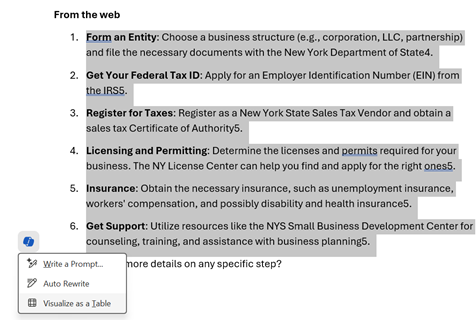
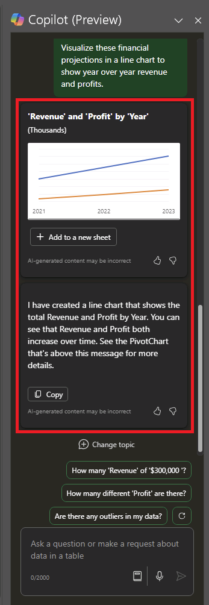
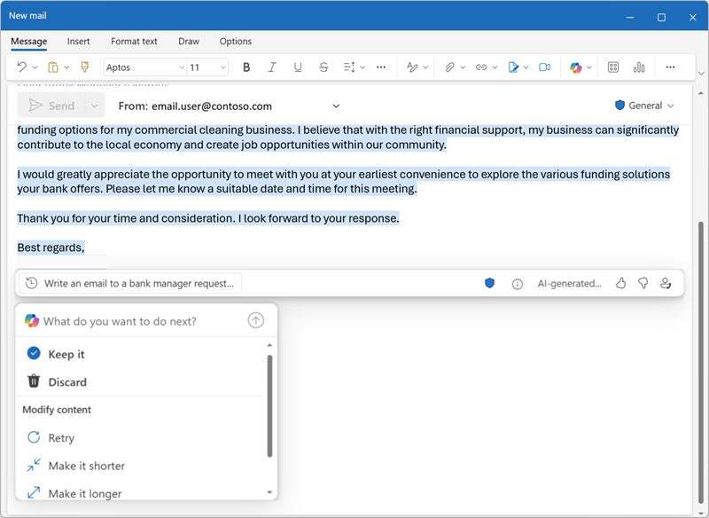
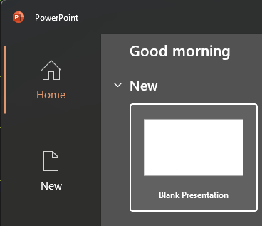
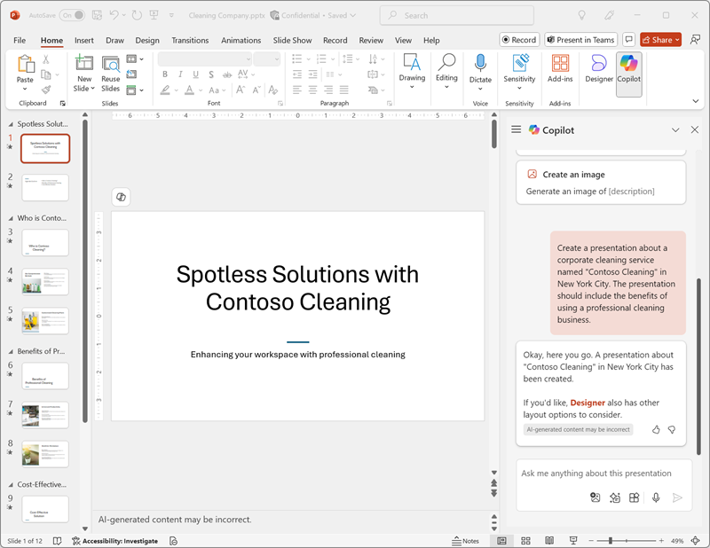

---
lab:
  title: استكشاف Copilot لـ Microsoft 365
---
# استكشاف Copilot لـ Microsoft 365

في هذا التمرين، ستستكشف بعض الطرق التي يمكن من خلالها لـ Microsoft Copilot استخدام الذكاء الاصطناعي التوليدي لمساعدتك على أن تكون أكثر إنتاجية عند إنشاء محتوى جديد. في سيناريو هذا التمرين، ستبدأ ببعض الملاحظات عالية المستوى لفكرة الأعمال، وتستخدم Copilot لـ Microsoft 365 عبر تطبيقات متعددة مثل Word وPowerPoint وExcel لمساعدتك في تطوير خطة عمل وعرض تقديمي للمستثمرين المحتملين.

يجب أن يستغرق هذا التمرين حوالي **40** دقيقة حتى يكتمل.

> **ملاحظة**: يتطلب هذا التمرين ترخيص **Copilot لـ Microsoft 365** من مؤسستك.

## استخدام Copilot لاستكشاف مستند والبحث عن فكرة

لبدء استكشافك الذكاء الاصطناعي التوليدي، دعنا نستخدم Copilot مع Word لفحص مستند موجود واستخراج بعض نتائج تحليلات منه.

1. في مستعرض الويب، افتح المستند [Business Idea.docx](https://github.com/MicrosoftLearning/mslearn-ai-fundamentals/raw/main/data/generative-ai/Business%20Idea.docx) في `https://github.com/MicrosoftLearning/mslearn-ai-fundamentals/raw/main/data/generative-ai/Business%20Idea.docx`. 
1. حدد **تنزيل** لحفظ الملف في مجلد **التنزيلات**الخاص بالكمبيوتر.
1. **انقل** المستند الذي قمت بتنزيله للتو إلى **مجلد OneDrive** أو **انسخه والصقه**.
1. **من مجلد OneDrive**، افتح **Business Idea.docx** في Microsoft Word (مع إغلاق أي رسائل ترحيب أو إعلامات بالميزات الجديدة) وراجع المستند، الذي يصف بعض الأفكار عالية المستوى لأعمال التنظيف في مدينة نيويورك. إذا طلب منك ذلك، فحدد **تمكين التحرير** في الأعلى.
1. ابحث عن أيقونة **Copilot** وحددها على شريط أدوات Word لفتح جزء Copilot، كما هو موضح هنا (قد يختلف النسق المرئي):

    

1. في جزء Copilot، أدخل باتباع المطالبة في مربع النص بالأسفل:

    ```
    What is this document about?
    ```

1. راجع الاستجابة من Copilot، التي يجب أن تلخص النقاط الرئيسية في المستند، كما هو موضح هنا:

    

    > قد تختلف الاستجابة المحددة التي تتلقاها بسبب طبيعة الذكاء الاصطناعي التوليدي.

1. ارجع إلى جزء Copilot لطرح السؤال التالي على Copilot:

    ```
    How do I setup a new business in New York?
    ```

1. راجع الاستجابة وتابع الأسئلة الإضافية حسب الحاجة. عندما تكون راضيًا عن الاستجابة، استخدم **أيقونة نسخ** (#128461;) ضمن الاستجابة لنسخها إلى الحافظة. الصقه في مستند Word، وحدد النص بالكامل ثم حدد أيقونة Copilot لتصور النص كجدول.

    

1. راجع الجدول واطلب من Copilot إضافة المزيد من المعلومات، مثل المراجع للحصول على مزيد من التفاصيل.  يجب أن تبدو استجابتك كما يلي (قد تحتاج إلى استخدام **الزر إعادة الكتابة**):

    

    > **مهم**: تستند الاستجابة المستندة إلى الذكاء الاصطناعي إلى معلومات عامة على الويب. في حين أنه قد يكون من المفيد مساعدتك على فهم الخطوات المطلوبة لإنشاء عمل تجاري، فإنه ليس من المضمون أن تكون دقيقة بنسبة 100% ولا تحل محل الحاجة إلى المشورة المهنية!

1. عندما تكون راضيًا عن الجدول الذي أنشأه Copilot، حدد خيار **للاحتفاظ به**.

## استخدام Copilot لإنشاء محتوى لخطة عمل

الآن بعد أن أجريت بعض الأبحاث الأولية، دعنا نساعدك باستخدام Copilot على وضع خطة عمل لشركة التنظيف الخاصة بك.

1. مع استمرار فتح مستند **Business Idea.docx**، في جزء Copilot، أدخل المطالبة التالية:

    ```
    Can you suggest a name for my cleaning business?
    ```

1. راجع الاقتراحات وحدد اسمًا لشركة التنظيف (أو تابع المطالبة بالعثور على الاسم الذي تريده).
1. في مستند Word، حدد أيقونة Copilot في الهامش لصياغة محتوى جديد. أدخل المطالبة التالية، واستبدل **Contoso Cleaning** باسم الشركة الذي تختاره:

    ```
    Write a business plan for "Contoso Cleaning" based on the information in this document. Include an executive summary, market overview, and financial projections.
    ```

    

1. راجع الاستجابة التي صاغها Copilot واحتفظ بها أو اضبط الأسلوب أو الطول أو اطلب من Copilot إعادة كتابتها باستخدام مطالبة جديدة. يمكنك تطبيق الأسلوب والعناوين المناسبة على المستند لديك لجعله يبدو احترافيًا. ينبغي أن تبدو الاستجابة الخاص بك على النحو التالي:

    

1. إذا لم يتم تنسيق التوقعات المالية في خطة العمل كجدول، فحددها واستخدم Copilot لتصور التوقعات كجدول.
1. حدد جدول التوقعات المالية وانسخه إلى الحافظة.
1. احفظ مستند Word.

## عرض التوقعات المالية بشكل بياني في Copilot لـ Excel

مع وجود خطة عمل في متناول اليد، فلنأخذ بعضًا من تلك البيانات حول التوقعات المالية ونطلب من Copilot في Excel عرض تلك البيانات لنا بشكل بياني، حتى نتمكن من تضمينها في رسائل البريد الإلكتروني أو العروض التقديمية للمستثمرين.

1. على الكمبيوتر الشخصي مع تثبيت تطبيقات Microsoft 365، افتح **Excel** وأنشئ مصنفًا فارغًا جديدًا. احفظ المصنف فورًا بتنسيق **Financial Projetions.xlsx** إلى OneDrive، وإلا لن يعمل Copilot.
1. الصق جدول توقع المبيعات من **Business Idea.docx** في جدول بيانات Excel وقم **بتنسيقه كجدول**. للقيام بذلك:
    1. حدد **خلية** داخل بياناتك.
    1. حدد **الصفحة الرئيسية** واختر **تنسيق كجدول** ضمن الأنماط. 
    1. اختر نمط لجدولك.
    1. في مربع الحوار**إنشاء جدول**، قم بتأكيد نطاق الخلايا أو قم بتعيينه.
    1. ضع علامة على ما إذا كان الجدول يحتوي على رؤوس، وحدد **موافق**.
1. باستخدام تنسيق توقعات المبيعات كجدول، افتح جزء Copilot من شريط Excel وأدخل المطالبة التالية:

    ```
    Suggest ways to visualize these financial projections.
    ```
    
1. يجب أن يقترح Copilot طريقة واحدة أو طريقتين لتصور بياناتك وعرض إضافة مخطط محوري إلى ورقة جديدة.

    

1. ومع ذلك، قد تحتاج إلى رؤية المزيد من البيانات في المخطط لإظهار التغييرات على مدار السنة، لذا أدخل المطالبة التالية لإضافة المزيد:

    ```
    Visualize these financial projections in a line chart to show year-over-year revenue and profits.
    ```

    

1. أضف المخطط المحوري إلى ورقة جديدة وافتحه. حدد المخطط ثم حدد **Design** لتطبيق الأنماط وتغيير نوع المخطط والإجراءات الأخرى. في النهاية، يجب أن يكون لديك شيء يشبه هذا:

    

1. احفظ الملف في OneDrive وأغلق Excel.

لقد استخدمت للتو البيانات التي تم إنشاؤها من Copilot في Word لعرضها بشكل بياني في Excel. في التمرين التالي، ستنتقل إلى استخدام Copilot في Outlook لإنشاء رسائل بريد إلكتروني وإرسالها حول العمل الذي قمت به.

## استخدام Copilot لإنشاء رسالة بريد إلكتروني

لقد أنشأت بعض الوثائق المرفقة لمساعدتك في بدء عملك. حان الوقت الآن للتواصل مع مستثمر يبحث عن بعض تمويل بدء التشغيل.

1. على الكمبيوتر الشخصي الذي تم تثبيت تطبيقات Microsoft 365 عليه، افتح **Outlook**. إذا لم تقم بإعداد Outlook باستخدام حساب Microsoft 365، فشاهد [إعداد واستخدام Outlook - دعم Microsoft](https://support.microsoft.com/office/set-up-and-use-outlook-4636f361-d5e3-4a87-9cd4-382858de55fa).
1. قم بتشغيل تجربة** Outlook**الجديدة. للحصول على أحدث ميزات Copilot في Outlook، يجب أن تستخدم تجربة جديدة لـ "Outlook". لمعرفة الإصدار الذي تستخدمه، راجع [ما هو إصدار Outlook المتوفر لدي؟ - دعم](https://support.microsoft.com/office/what-version-of-outlook-do-i-have-b3a9568c-edb5-42b9-9825-d48d82b2257c) Microsoft.
1. قم بإنشاء بريد إلكتروني جديد، واملأ المربع **إلى** بعنوان بريدك الإلكتروني الخاص.
1. يمكنك البدء في صياغة بريدك الإلكتروني من جزء Copilot أو مباشرة من داخل النص الأساسي للبريد الإلكتروني:

    
    
1. أدخل المطالبة التالية واضبط الأسلوب إلى "رسمي" والطول إلى "متوسط":

    ```
    Request a meeting with an investment bank to discuss funding for a commercial cleaning business.
    ```

    

1. حدد **Generate draft**، وراجع الإخراج الذي تم إنشاؤه. اضبط الأسلوب أو أخبر Copilot بما تريد تغييره حول البريد الإلكتروني.

    

1. يمكنك إرسال البريد الإلكتروني إلى نفسك إذا كنت ترغب في ذلك!

## استخدام Copilot لإنشاء محتوى لعرض تقديمي

بمساعدة Copilot، لقد أنشأت مسودة خطة عمل لفكرة أعمال التنظيف، وأعددت بعض التوقعات المالية، وأرسلت بريدًا إلكترونيًا لطلب عقد اجتماع مع مستثمر محتمل. ستحتاج الآن إلى عرض تقديمي فعال للتعبير عن فوائد عملك.

1. افتح **PowerPoint** وأنشئ عرضًا تقديميًا** فارغًا جديدًا**. إذا تم فتح جزء **Designer** تلقائيًا، فقم بإغلاقه.

    

1. احفظ العرض التقديمي بتنسيق **Cleaning Company.pptx** في مجلد OneDrive.
1. **حدد زر** Copilot في **علامة تبويب الصفحة الرئيسية**على الشريط، وحدد **إنشاء عرض تقديمي حول...**، ثم أكمل المطالبة في جزء Copilot كما يلي:

    ```
    Create a presentation about a corporate cleaning service in New York City.
    ```

1. سيقوم Copilot بإنشاء شرائح في العرض التقديمي.  قد تستغرق العملية عدة دقائق ويجب أن تبدو المخرجات الخاص بك شيئا من هذا القبيل مع موضوع مختلف:

    

1. حدد الشريحة الأخيرة الثانية في العرض التقديمي. بعد ذلك، في جزء Copilot، اطلب إضافة شريحة جديدة باستخدام هذه المطالبة:

    ```
    Add a slide that describes the benefits of an eco-friendly approach to cleaning. 
    ```

    

1. احفظ العرض التقديمي.

## التحدي

لقد رأيت الآن كيفية استخدام Copilot لـ Microsoft 365 في تطبيقين مختلفين للبحث عن الأفكار وإنشاء المحتوى، فلما لا تحاول استكشاف المزيد؟ حاول استخدام Copilot للتخطيط لحدث للترويج لمحو الأمية لدى الأطفال في مكتبة محلية. تتضمن بعض الأشياء التي يمكنك تجربتها ما يلي:

- ابحث عن بعض النصائح لتشجيع الأطفال على القراءة في سن مبكرة.
- قم بإنشاء نشرة إعلانية أو ملصق للحدث.
- قم بإنشاء رسالة بريد إلكتروني لحملة لدعوة كتاب الأطفال المحليين للحضور والتحدث في الحدث.
- إنشاء عرض تقديمي لبدء الحدث.

كن مبتكرًا كما تريد، واستكشف كيف يمكن لـ Copilot مساعدتك من خلال العثور على المعلومات، وإنشاء النصوص وتحسينها، وإنشاء الصور، والإجابة على الأسئلة.

## الخاتمة

في هذا التمرين، استخدمت[ Copilot لـ Microsoft 365 ](https://www.microsoft.com/microsoft-365/enterprise/copilot-for-microsoft-365)للعثور على المعلومات وإنشاء المحتوى. نأمل أن تكون قد رأيت كيف يمكن أن يساعد استخدام الذكاء الاصطناعي التوليدي في copilot في الإنتاجية والإبداع. يتيح لك Microsoft 365 إمكانية توفير قوة الذكاء الاصطناعي التوليدي لبيانات وعمليات عملك، مع التكامل في البنية الأساسية الحالية لتكنولوجيا المعلومات لضمان حل آمن وقابل للإدارة.
