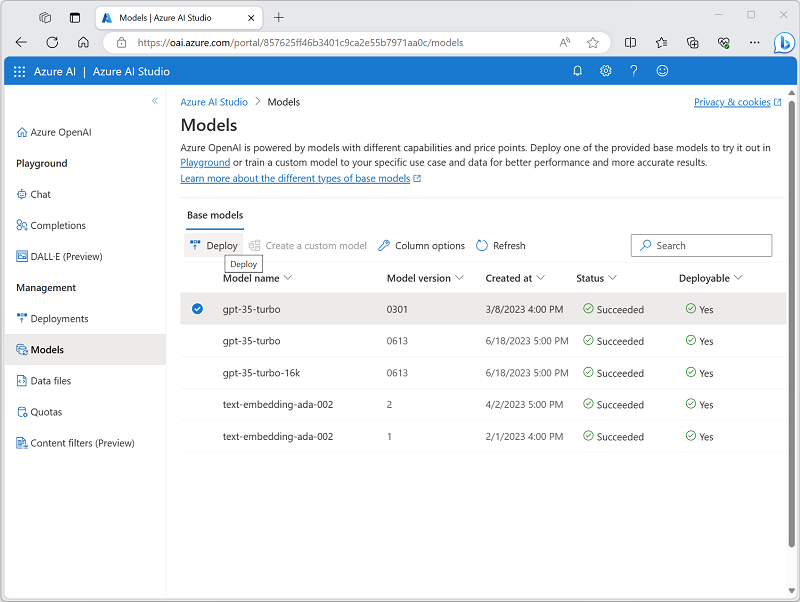
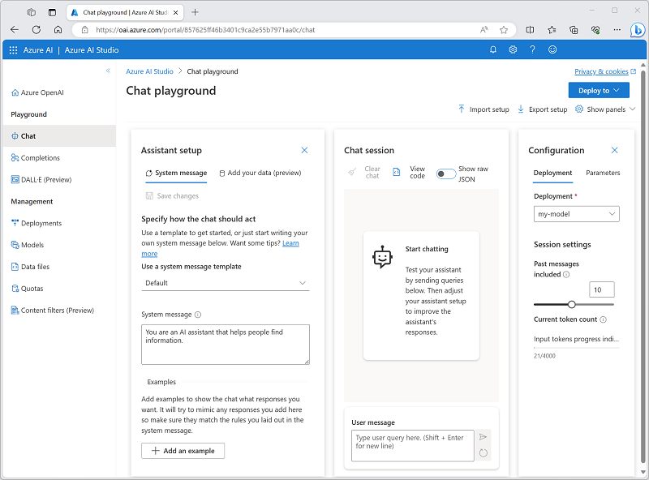

---
lab:
  title: استكشاف خدمة Azure OpenAI
---

# استكشاف Azure OpenAI

توفر خدمة Azure OpenAI نماذج الذكاء الاصطناعي التوليدية التي تم تطويرها بواسطة OpenAI إلى النظام الأساسي ل Azure، مما يتيح لك تطوير حلول الذكاء الاصطناعي قوية تستفيد من أمان وقابلية التوسع وتكامل الخدمات التي يوفرها النظام الأساسي السحابي ل Azure.

في هذا التمرين، ستستكشف خدمة Azure OpenAI وتستخدمها لنشر نماذج الذكاء الاصطناعي التوليدية وتجربتها.

سيستغرق هذا التمرين حوالي **25** دقيقة.

## قبل أن تبدأ

ستحتاج إلى اشتراك Azure الذي تمت الموافقة عليه للوصول إلى خدمة Azure OpenAI لكل من نماذج النص والرمز ونماذج إنشاء صور DALL-E.

- للتسجيل في اشتراك Azure مجاني، تفضل بزيارة [https://azure.microsoft.com/free](https://azure.microsoft.com/free).
- لطلب الوصول إلى خدمة Azure OpenAI، قم بزيارة [https://aka.ms/oaiapply](https://aka.ms/oaiapply).

## توفير مورد Azure OpenAI

قبل أن تتمكن من استخدام نماذج Azure OpenAI، يجب توفير مورد Azure OpenAI في اشتراك Azure الخاص بك.

1. قم بتسجيل الدخول إلى [مدخل Azure](https://portal.azure.com).
2. **إنشاء مورد Azure OpenAI** بالإعدادات التالية:
    - **الاشتراك**: *اشتراك Azure تمت الموافقة عليه للوصول إلى خدمة Azure OpenAI.*
    - **مجموعة** الموارد: *اختر مجموعة موارد موجودة أو أنشئ مجموعة جديدة باسم من اختيارك.*
    - **المنطقة**: شرق الولايات المتحدة\*
    - **الاسم**: *اسم فريد من اختيارك*
    - **مستوى التسعير**: قياسي S0

    > \* تتمتع المناطق المختلفة بتوافر وحصة مختلفة للنماذج. في هذا التمرين، ستستخدم نموذج GPT-35-Turbo لإنشاء النص ونموذج DALL-E لإنشاء الصور، وكلاهما مدعوم في شرق الولايات المتحدة.

3. يُرجى الانتظار لاكتمال التوزيع. ثم انتقل إلى مورد Azure OpenAI المنشور في مدخل Microsoft Azure.

## استكشاف Azure OpenAI Studio

يمكنك نشر النماذج وإدارتها واستكشافها في خدمة Azure OpenAI باستخدام Azure OpenAI Studio.

1. في **صفحة نظرة عامة** لمورد Azure OpenAI، استخدم **الزر استكشاف** لفتح Azure OpenAI Studio في علامة تبويب مستعرض جديدة. بدلا من ذلك، انتقل إلى [Azure OpenAI Studio](https://oai.azure.com/) مباشرة.

    عند فتح Azure OpenAI Studio لأول مرة، يجب أن يبدو مشابها لما يلي:

    

1. عرض الصفحات المتوفرة في الجزء الموجود على اليسار. يمكنك دائما العودة إلى الصفحة الرئيسية في الأعلى. بالإضافة إلى ذلك، يوفر OpenAI Studio صفحات متعددة حيث يمكنك:
    - تجربة النماذج في *ملعب*.
    - إدارة عمليات نشر النموذج وبياناته.

## نشر نموذج لإنشاء اللغة

لتجربة إنشاء اللغة الطبيعية، يجب أولا نشر نموذج.

1. في **صفحة Models** ، اعرض النماذج المتوفرة في مثيل خدمة Azure OpenAI.
1. حدد أيا من **نماذج gpt-35-turbo** التي **تكون حالة Deployable** لها نعم****، ثم حدد **Deploy**:

    

1. إنشاء نشر جديد بالإعدادات التالية:
    - **الطراز**: gpt-35-turbo
    - **إصدار** النموذج: التحديث التلقائي إلى الافتراضي
    - **اسم** النشر: *اسم فريد لنشر النموذج الخاص بك*
    - **خيارات متقدمة**
        - **عامل تصفية** المحتوى: افتراضي
        - **نوع** التوزيع: قياسي
        - **حد** معدل الرموز المميزة في الدقيقة: 5K\*
        - **تمكين الحصة النسبية الديناميكية**: ممكن

    > \* الحد الأقصى لمعدل 5000 رمز مميز في الدقيقة هو أكثر من كاف لإكمال هذا التمرين مع ترك سعة للأشخاص الآخرين الذين يستخدمون نفس الاشتراك.

## استخدام ملعب الدردشة ** للعمل مع النموذج

الآن بعد أن قمت بنشر نموذج، يمكنك استخدامه في *ملعب الدردشة* لإنشاء إخراج اللغة الطبيعية من المطالبات التي ترسلها في واجهة دردشة.

1. في [Azure OpenAI Studio](https://oai.azure.com/)، انتقل إلى ملعب الدردشة **** في الجزء الأيمن.

    *يوفر ملعب الدردشة* واجهة روبوت الدردشة التي يمكنك التفاعل معها مع النموذج المنشور، كما هو موضح هنا:

    

1. في **جزء التكوين** ، تأكد من تحديد توزيع النموذج الخاص بك.
1. في **جزء إعداد** المساعد، حدد **قالب رسالة النظام الافتراضي** ، واعرض رسالة النظام التي ينشئها هذا القالب. تحدد رسالة النظام كيفية تصرف النموذج في جلسة الدردشة.
1. في **قسم جلسة** الدردشة، أدخل رسالة المستخدم التالية.

    ```
   What is generative AI?
    ```

1. لاحظ الإخراج الذي تم إرجاعه بواسطة النموذج، والذي يجب أن يوفر تعريفا الذكاء الاصطناعي التوليدية.
1. أدخل رسالة المستخدم التالية كسؤال متابعة:

    ```
   What are three benefits it provides?
    ```

1. راجع الإخراج، مع ملاحظة أن جلسة الدردشة تتبع الإدخال والاستجابة السابقين لتوفير السياق (لذلك تفسر "ذلك" بشكل صحيح على أنه يشير إلى "الذكاء الاصطناعي التوليدي") وأنه يوفر استجابة مناسبة استنادا إلى ما تم طلبه (يجب أن ترجع ثلاث فوائد من الذكاء الاصطناعي التوليدية).

## *استخدام ملعب DALL-E* لإنشاء الصور

بالإضافة إلى نماذج إنشاء اللغة، تدعم خدمة Azure OpenAI نموذج DALL-E 2 لإنشاء الصور.

> **ملاحظة**: يجب أن تكون قد تقدمت بطلب للحصول على وظيفة DALL-E وتلقيتها في تطبيق الوصول إلى خدمة Azure OpenAI لإكمال هذا القسم من التمرين.

1. في [Azure OpenAI Studio](https://oai.azure.com/)، انتقل إلى **ملعب DALL-E** في الجزء الأيمن.
1. أدخل المطالبة التالية:

    ```
    A robot eating spaghetti
    ```

1. حدد **Generate** واعرض النتائج، والتي يجب أن تتكون من صورة استنادا إلى الوصف الذي قدمته في المطالبة، على غرار هذا:

    

1. إنشاء صورة ثانية عن طريق تعديل المطالبة إلى:

    ```
    A robot eating spaghetti in the style of Rembrandt
    ```
1. تحقق من أن الصورة الجديدة تطابق متطلبات المطالبة، على غرار هذا:

    

## تنظيف

عند الانتهاء من مورد Azure OpenAI، تذكر حذف التوزيع أو المورد بأكمله في [مدخل](https://portal.azure.com/?azure-portal=true) Microsoft Azure.
