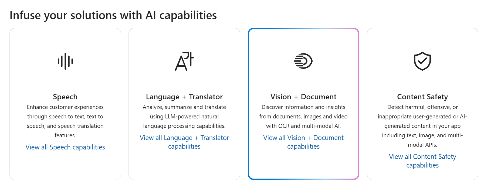
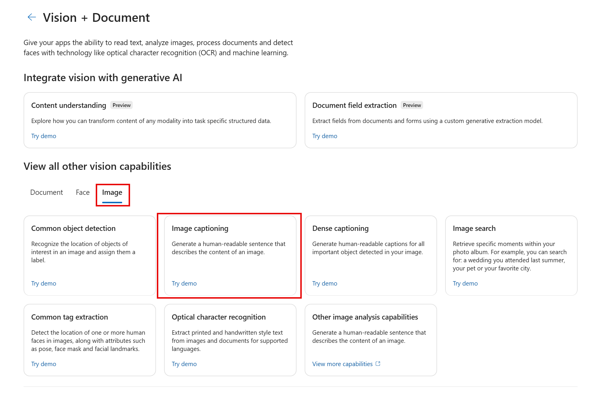
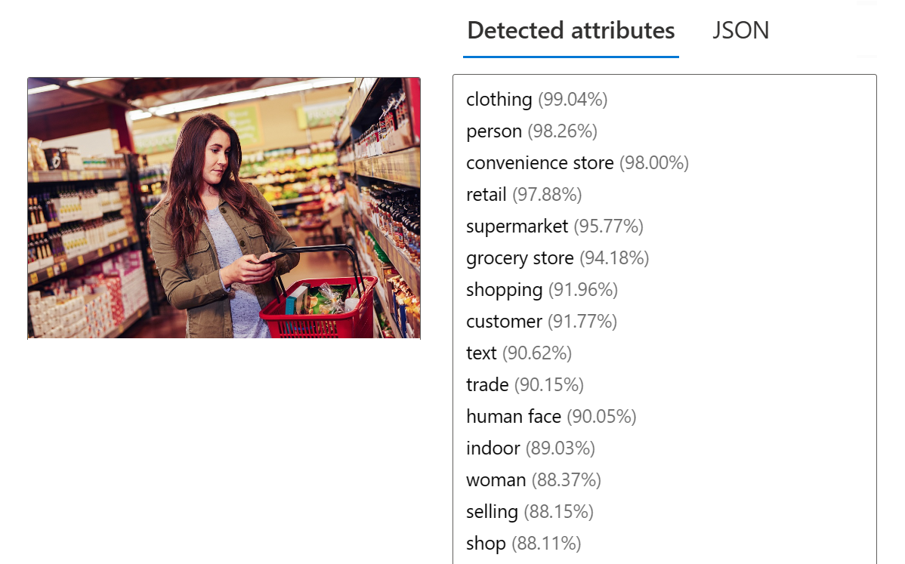

---
lab:
  title: تحليل الصور في مدخل Azure AI Foundry
---

# تحليل الصور في مدخل Azure AI Foundry

تتضمن **Azure AI Vision** العديد من القدرات لفهم محتوى الصورة والسياق واستخراج المعلومات من الصور. في هذا التمرين، ستستخدم Azure AI Vision في مدخل Azure AI Foundry، وهي منصة Microsoft لإنشاء التطبيقات الذكية، لتحليل الصور باستخدام التجارب المدمجة. 

افترض أن بائع التجزئة الوهمي *Northwind Traders* قرر تنفيذ "متجر ذكي"، حيث تراقب خدمات الذكاء الاصطناعي المتجر لتحديد العملاء الذين يحتاجون إلى المساعدة، وتوجيه الموظفين لمساعدتهم. باستخدام Azure AI Vision، يمكن تحليل الصور التي التقطتها الكاميرات في جميع أنحاء المتجر لتقديم أوصاف ذات مغزى لما تصوره.

## إنشاء مشروع في مدخل Azure AI Foundry

1. في علامة تبويب المتصفح، انتقل إلى [Azure AI Foundry](https://ai.azure.com?azure-portal=true).

1. سجل الدخول باستخدام حسابك. 

1. في الصفحة الرئيسية لمدخل Azure AI Foundry، حدد **إنشاء مشروع**. في Azure AI Foundry، تعتبر المشاريع عبارة عن حاويات تساعد في تنظيم عملك.  

    

1. في جزء *إنشاء مشروع*، سترى اسم مشروع تم إنشاؤه، والذي يمكنك الاحتفاظ به كما هو. اعتمادًا على ما إذا كنت قد قمت بإنشاء مركز في الماضي، فسترى إما قائمة بالموارد Azure *الجديدة* التي سيتم إنشاؤها أو قائمة منسدلة بالمراكز الموجودة. إذا رأيت القائمة المنسدلة للمراكز الموجودة، فحدد *إنشاء مركز جديد*، ثم أنشئ اسمًا فريدًا للمركز الخاص بك، ثم حدد *التالي*.  
 
    

    > **هام**: ستحتاج إلى توفير موارد خدمات الذكاء الاصطناعي في Azure في موقع محدد لاستكمال بقية النشاط العملي.

1. في نفس جزء *إنشاء مشروع*، حدد **تخصيص** وحدد أحد **المواقع** التالية: *شرق الولايات المتحدة، أو وسط فرنسا، أو وسط كوريا، أو غرب أوروبا، أو غرب الولايات المتحدة* لإكمال بقية النشاط العملي. حدد **التالي** ثم حدد **إنشاء**. 

1. لاحظ الموارد التي تم إنشاؤها: 
    - خدماتالذكاء الاصطناعي في Azure
    - مركز الذكاء الاصطناعي في Azure
    - مشروع الذكاء الاصطناعي في Azure
    - حساب التخزين
    - Key Vault
    - مجموعة الموارد  
 
1. بعد إنشاء الموارد، سيتم نقلك إلى صفحة *نظرة عامة* الخاصة بمشروعك. في القائمة الموجودة على الجانب الأيسر من الشاشة، حدد **خدمات الذكاء الاصطناعي**.
 
      

1. في صفحة *خدمات الذكاء الاصطناعي*، حدد لوحة *الرؤية + المستند* لتجربة إمكانات المستندات والرؤية من الذكاء الاصطناعي في Azure

    

## إنشاء تسميات توضيحية لصورة

دعنا نستخدم وظيفة تسمية الصور في Azure AI Vision لتحليل الصور الملتقطة بواسطة كاميرا في متجر *Northwind Traders*. تتوفر التسميات التوضيحية للصور من خلال ميزات **التسمية التوضيحية** و**التسميات التوضيحية الكثيفة** .

1. في صفحة *الرؤية + المستند*، مرّر لأسفل وحدد **الصورة** ضمن *عرض كل إمكانات الرؤية الأخرى*. ثم حدد لوحة **تسمية الصورة**.

    

1. في صفحة **إضافة تسميات توضيحية للصور**، راجع المورد الذي تتصل به والمدرج ضمن العنوان الفرعي **جرّبه**. يجب ألا تضطر إلى إجراء تغييرات. (*ملاحظة*: إذا لم تقم بتخصيص موقع مورد صالح في وقت سابق أثناء إنشاء المورد، فقد يُطلب منك إنشاء مورد جديد لخدمات الذكاء الاصطناعي في Azure موجود في منطقة صالحة. ستحتاج إلى إنشاء المورد الجديد لمواصلة النشاط العملي.)  

1. حدد [**https://aka.ms/mslearn-images-for-analysis**](https://aka.ms/mslearn-images-for-analysis) لتنزيل **image-analysis.zip**. افتح المجلد على الكمبيوتر وحدد موقع الملف المسمى **store-camera-1.jpg**؛ الذي يحتوي على الصورة التالية:

    

1. قم بتحميل صورة **store-camera-1.jpg** عن طريق سحبها إلى مربع **سحب الملفات وإفلاتها هنا**، أو عن طريق استعراضها على نظام الملفات.

1. لاحظ نص التسمية التوضيحية الذي تم إنشاؤها، مرئي في لوحة **السمات المكتشفة** على يمين الصورة.

    توفر وظيفة **التسمية التوضيحية** جملة إنجليزية واحدة يمكن للبشر قراءتها تصف محتوى الصورة.

1. بعد ذلك، استخدم الصورة نفسها لإجراء **تسمية توضيحية كثيفة**. عُد إلى صفحة **الرؤية + المستند** عن طريق تحديد سهم *الرجوع* في أعلى الصفحة. في صفحة *الرؤية + المستند*، حدد علامة التبويب **الصورة**، ثم حدد لوحة **التسميات التوضيحية الكثيفة**.

    تختلف ميزة **التسميات التوضيحية الكثيفة** عن إمكانية **التسمية التوضيحية** من حيث أنها توفر العديد من التسميات التوضيحية القابلة للقراءة من قبل الإنسان للصورة، واحدة تصف محتوى الصورة والأخرى، كل منها يغطي العناصر الأساسية المكتشفة في الصورة. يتضمن كل كائن تم اكتشافه مربع إحاطة، والذي يحدد إحداثيات البكسل داخل الصورة المقترنة بالعنصر.

1. مرر مؤشر الماوس فوق أحد التسميات التوضيحية في قائمة السمات **المكتشفة** ولاحظ ما يحدث داخل الصورة.

    

    حرك مؤشر الماوس فوق التسميات التوضيحية الأخرى في القائمة، ولاحظ كيف ينتقل المربع المحيط في الصورة لتمييز جزء الصورة المستخدم لإنشاء التسمية التوضيحية.

## وضع علامات على الصور 

الميزة التالية التي ستجربها هي وظيفة *استخراج العلامات* . تستند علامات الاستخراج إلى آلاف الكائنات التي يمكن التعرف عليها، بما في ذلك الكائنات الحية والمناظر الطبيعية والإجراءات.

1. عُد إلى صفحة *الرؤية + المستند* في Azure AI Foundry، ثم حدد علامة التبويب **الصورة**، ثم حدد لوحة **استخراج العلامة الشائعة**.

2. في **اختيار النموذج الذي تريد تجربته**، اترك **نموذج المنتج الذي تم إنشاؤه مسبقاً مقابل نموذج الفجوة محدداً**. في **اختيار لغتك**، حدد **اللغة الإنجليزية** أو لغة من تفضيلاتك.

3. افتح المجلد الذي يحتوي على الصور التي قمت بتنزيلها وحدد موقع الملف المسمى **store-image-2.jpg**، والذي يبدو كما يلي:

    

4. قم بتحميل ملف **store-camera-2.jpg**.

5. راجع قائمة العلامات المستخرجة من الصورة ودرجة الثقة لكل منها في لوحة السمات المكتشفة. هنا درجة الثقة هي احتمال أن يصف نص السمة المكتشفة ما هو في الواقع في الصورة. لاحظ في قائمة العلامات أنه لا يتضمن الكائنات فقط، ولكن الإجراءات، مثل *التسوق* و*البيع* و*الوقوف*.

    

## كشف الكائنات

في هذه المهمة، يمكنك استخدام ميزة **الكشف عن الكائنات** لتحليل الصور. الكشف عن الكائنات يكتشف ويستخرج مربعات الإحاطة استناداً إلى آلاف الكائنات التي يمكن التعرف عليها والكائنات الحية.

1. عُد إلى صفحة *الرؤية + المستند* في Azure AI Foundry، ثم حدد علامة التبويب **الصورة**، واختر لوحة **اكتشاف الكائنات الشائعة**.

1. في **اختيار النموذج الذي تريد تجربته**، اترك **نموذج المنتج الذي تم إنشاؤه مسبقاً مقابل نموذج الفجوة محدداً**.

1. افتح المجلد الذي يحتوي على الصور التي قمت بتنزيلها وحدد موقع الملف المسمى **store-camera-3.jpg**، والذي يبدو كما يلي:

    

1. قم بتحميل ملف **store-camera-3.jpg**.

1. في مربع **السمات المكتشفة**، لاحظ قائمة الكائنات المكتشفة ودرجات الثقة الخاصة بها.

1. مرر مؤشر الماوس فوق الكائنات في قائمة **السمات المكتشفة** لتمييز مربع إحاطة العنصر في الصورة.

1. حرك شريط تمرير **قيمة الحد** حتى يتم عرض قيمة 70 إلى يمين شريط التمرير. لاحظ ما يحدث للكائنات في القائمة. يحدد شريط تمرير الحد أنه يجب عرض الكائنات المحددة بدرجة ثقة أو احتمال أكبر من الحد فقط.

## تنظيف

إذا كنت لا تنوي إجراء المزيد من التدريبات، فاحذف أي موارد لم تعد بحاجة إليها. وهذا يتجنب تكبد أي تكاليف غير ضرورية.

1.  افتح [بوابة Azure]( https://portal.azure.com) وحدد مجموعة الموارد التي تحتوي على الموارد التي قمت بإنشائها. 
1.  حدد المورد وحدد **حذف** ثم **نعم** للتأكيد. من ثم يتم حذف المورد.

## معرفة المزيد

لمعرفة المزيد حول ما يمكنك القيام به بهذه الخدمة، راجع [صفحة Azure AI Vision](https://learn.microsoft.com/azure/ai-services/computer-vision/overview).
