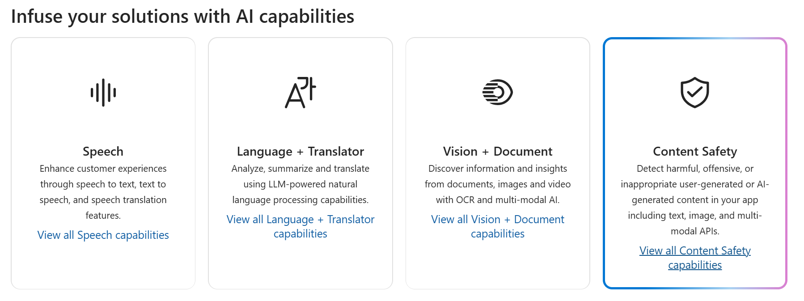

---
lab:
  title: استكشاف أمان المحتوى في Azure AI Foundry
---

# استكشاف أمان المحتوى في Azure AI Foundry

تساعد خدمات الذكاء الاصطناعي في Azure المستخدمين على إنشاء تطبيقات الذكاء الاصطناعي باستخدام واجهات برمجة التطبيقات المبتكرة والنماذج الجاهزة والمبنية مسبقًا والقابلة للتخصيص. في هذا التمرين، ستلقي نظرة على إحدى الخدمات، أمان المحتوى باستخدام الذكاء الاصطناعي في Azure، التي تمكنك من تعديل محتوى النصوص والصور. في بوابة Azure AI Foundry، وهي منصة Microsoft لإنشاء التطبيقات الذكية، ستستخدم أمان المحتوى باستعمال الذكاء الاصطناعي في Azure لتصنيف النص وتعيين درجة خطورته. 

> **ملاحظه** الهدف من هذا التمرين هو تكوين فكرة عامة عن كيفية توفير خدمات Azure للذكاء الاصطناعي واستخدامها. يتم استخدام المحتوى السلامة كمثال، ولكن لا يتوقع منك اكتساب معرفة شاملة بسلامة المحتوى في هذا التمرين!

## إنشاء مشروع في مدخل Azure AI Foundry

1. في علامة تبويب المتصفح، انتقل إلى [مدخل Azure AI Foundry](https://ai.azure.com?azure-portal=true).

2. سجل الدخول باستخدام حسابك. 

3. في الصفحة الرئيسية لمدخل Azure AI Foundry، حدد **إنشاء مشروع**. في Azure AI Foundry، تعتبر المشاريع عبارة عن حاويات تساعد في تنظيم عملك.  

    

4. في جزء *إنشاء مشروع*، سترى اسم مشروع تم إنشاؤه، والذي يمكنك الاحتفاظ به كما هو. اعتمادًا على ما إذا كنت قد قمت بإنشاء مركز في الماضي، فسترى إما قائمة بالموارد Azure *الجديدة* التي سيتم إنشاؤها أو قائمة منسدلة بالمراكز الموجودة. إذا رأيت القائمة المنسدلة للمراكز الموجودة، فحدد *إنشاء مركز جديد*، ثم أنشئ اسمًا فريدًا للمركز الخاص بك، ثم حدد *التالي*.  
 
    

> **هام**: ستحتاج إلى توفير موارد خدمات الذكاء الاصطناعي في Azure في موقع محدد لاستكمال بقية النشاط العملي.

5. في نفس جزء *إنشاء مشروع*، حدد **تخصيص** ثم حدد أحد **المواقع** التالية: شرق الولايات المتحدة، أو وسط فرنسا، أو وسط كوريا، أو غرب أوروبا، أو غرب الولايات المتحدة لإكمال بقية النشاط العملي. ثم حدد **إنشاء**. 

1. لاحظ الموارد التي تم إنشاؤها: 
- خدماتالذكاء الاصطناعي في Azure
- مركز الذكاء الاصطناعي في Azure
- مشروع الذكاء الاصطناعي في Azure
- حساب التخزين
- Key Vault
- مجموعة الموارد  

6. بعد إنشاء الموارد، سيتم نقلك إلى صفحة *نظرة عامة* الخاصة بمشروعك. 

7. لتتمكن من استخدام "أمان المحتوى"، يتعين عليك إجراء تحديث أذونات لمورد *مركز الذكاء الاصطناعي في Azure* الخاص بك. للقيام بذلك، افتح [بوابة Azure](https://portal.azure.com?portal-azure=true) وسجّل الدخول باستخدام نفس الاشتراك الذي استخدمته لإنشاء موارد AI Foundry الخاصة بك.  

8. في بوابة Azure، استخدم شريط البحث الموجود أعلى الصفحة للبحث عن **Azure AI Foundry** وتحديده. في صفحة الموارد، حدد المورد الذي أنشأته للتو والذي يكون من *النوع***مركز الذكاء الاصطناعي في Azure**.  

9. في بوابة Azure، في الجزء الأيسر، حدد **التحكم بالوصول (IAM)**. بعد ذلك، في الجزء المفتوح، حدد **إضافة** بجانب علامة الإضافة + وحدد **إضافة تعيين دور**. 

10. ابحث عن **Azure AI Safety Evaluator** في قائمة الأدوار، ثم حدده. بعد ذلك حدد **التالي**. 

11. استخدم الإعدادات التالية لتعيين الدور لنفسك: 
    - **تعيين الوصول إلى**: حدد *المستخدم أو المجموعة أو كيان الخدمة*
    - **الأعضاء**: انقر فوق *تحديد الأعضاء*
        - في جزء *تحديد الأعضاء* المفتوح، ابحث عن اسمك. انقر فوق أيقونة الإضافة بجانب اسمك. ثم انقر فوق "**Select**".
    - **الوصف**: *اتركه فارغاً*

12. حدد **مراجعة وتعيين**ثم حدد **مراجعة وتعيين** مجدداً لإضافة تعيين الدور.    

13. في متصفحك، عُد إلى [مدخل Azure AI Foundry](https://ai.azure.com?azure-portal=true). حدد مشروعك. 

14. في القائمة الموجودة على الجانب الأيسر من الشاشة، حدد **خدمات الذكاء الاصطناعي**.
 
      

15. في صفحة *خدمات الذكاء الاصطناعي*، حدد لوحة *الرؤية + المستند* لتجربة إمكانات المستندات والرؤية من الذكاء الاصطناعي في Azure
    
    

## جرّب تعديل النص باستخدام "أمان المحتوى" في مدخل Azure AI Foundry 

1. في صفحة *سلامة المحتوى*، ضمن *تصفية محتوى النص*، حدد **تعديل محتوى النص**.

2. في صفحة *تعديل محتوى النص*، ضمن عنوان *جرّبه*، حدد مورد خدمات الذكاء الاصطناعي في Azure الذي قمت بإنشائه للتو من القائمة المنسدلة.   

3. ضمن *تشغيل اختبار بسيط*، حدد لوحة **المحتوى الآمن**. لاحظ أنه يتم عرض النص في المربع أدناه. 

4. انقر فوق **تشغيل الاختبار**. يؤدي تشغيل اختبار إلى استدعاء نموذج التعلم العميق لاستوديو سلامة المحتوى. تم بالفعل تدريب نموذج التعلم العميق على التعرف على المحتوى غير الآمن.

5. في لوحة *النتائج*، افحص النتائج. هناك أربعة مستويات خطورة من آمنة إلى عالية، وأربعة أنواع من المحتوى الضار. هل تعتبر خدمة سلامة المحتوى بالذكاء الاصطناعي أن هذه العينة مقبولة أم لا؟ ما يجب ملاحظته هو أن النتائج تقع ضمن نطاق الثقة. يمكن للنموذج المُدرب جيدًا، مثل أحد نماذج الذكاء الاصطناعي الجاهزة في Azure، إرجاع النتائج التي لديها احتمال كبير لمطابقة ما قد يصنفه الإنسان على النتيجة. في كل مرة تقوم فيها بتشغيل اختبار، يمكنك استدعاء النموذج مرة أخرى. 

6. الآن جرّب عينة أخرى. حدد النص ضمن المحتوى العنيف الذي به خطأ إملائي. تحقق من عرض المحتوى في المربع أدناه.

7. انقر فوق **تشغيل الاختبار** وافحص النتائج في لوحة النتائج مرة أخرى. 

يمكنك تشغيل الاختبارات على جميع العينات المقدمة، ثم فحص النتائج.

## التنظيف

إذا كنت لا تنوي إجراء المزيد من التدريبات، فاحذف أي موارد لم تعد بحاجة إليها. وهذا يتجنب تراكم أي تكاليف غير ضرورية.

1. افتح [مدخل Azure]( https://portal.azure.com) وحدد مجموعة الموارد التي تحتوي على المورد الذي أنشأته.
1. حدد المورد وحدد **حذف** ثم **نعم** للتأكيد. من ثم يتم حذف المورد.

## معرفة المزيد

لقد أظهر هذا التمرين بعضًا فقط من قدرات خدمة "أمان المحتوى". لمعرفة المزيد حول ما يمكنك فعله باستخدام هذه الخدمة، راجع [صفحة "أمان المحتوى"](https://learn.microsoft.com/azure/ai-services/content-safety/overview).